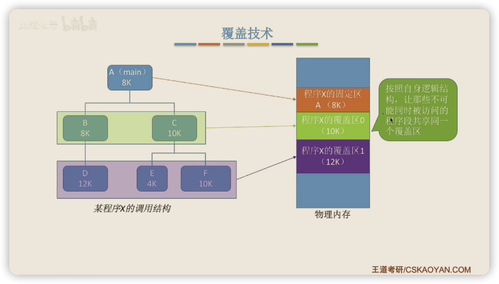
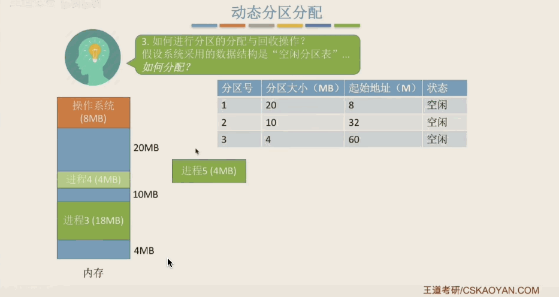
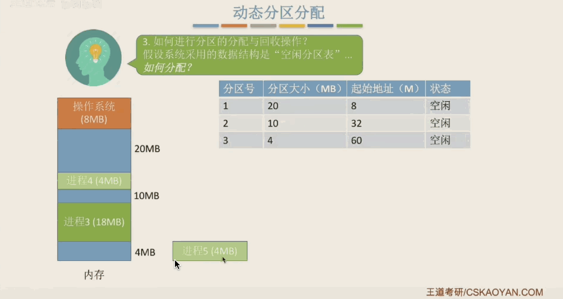
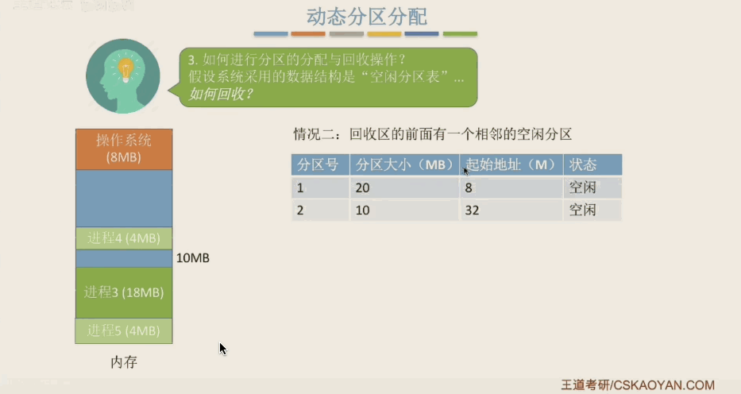
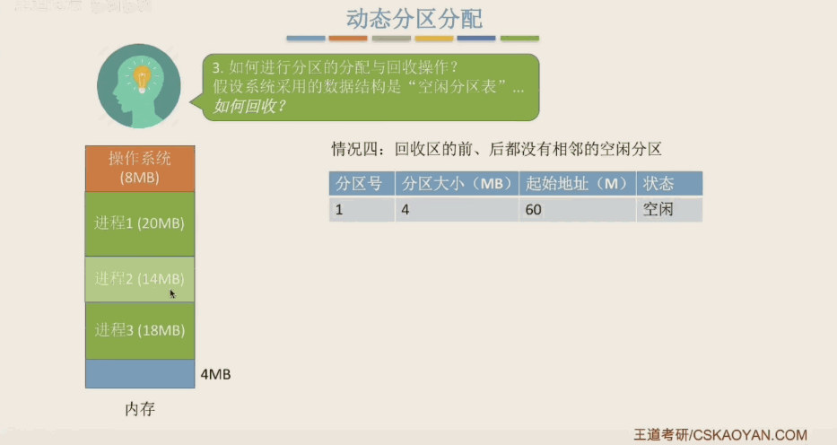

# 操作系统


## 第一章

### 操作系统的概念

用户

&darr;

应用程序

&darr;

操组系统

&darr;

裸机（纯硬件）


1. 负责管理协调硬件、软件等计算机资源的工作
2. 为上层的应用程序、用户提供简单易用的服务
3. 操作系统时系统软件，而不是硬件


#### 操作系统的定义

操作系统是指控制和管理整个计算机系统的硬件和软件资源，并合理的组织调度计算机的工作和资源的分配，以提供给用户和其他软件方便的接口和环境，它是计算机系统中最基本的系统软件。


#### 操作系统的功能

##### 作为系统资源的管理者

功能：

- 处理机管理
- 存储器管理
- 文件管理
- 设备管理

目标：安全、高效


##### 作为用户和计算机硬件之间的接口

功能：

- 命令接口

  允许用户直接使用

  - 联机命令接口

    用户说一句，系统做一句

  - 脱机命令接口

    用户说一堆，系统做一堆

- 程序接口

  允许用户通过程序间接使用

  由一组系统调用组成，程序接口 = 系统调用

- GUI（图形用户界面）

  用户可以使用形象的图形界面进行操作，而不需要记忆复杂的命令、参数

目标：方便用户使用


易懵概念：

系统调用 = 系统调用命令 = 广义指令


##### 作为最接近硬件的层次

需要提供的功能和目标：实现对硬件机器的拓展

没有任何软件支持的计算机称为裸机

通常把覆盖了软件的机器称为扩充机器，又称为虚拟机


### 操作系统的特征

#### 并发

指两个或多个事件在同一时间间隔内发生，这些事件宏观上是同时发生的，但微观上是交替发生的，操作系统的并发性指计算机系统中同时存在着多个运行着的程序。

一个单核处理机（CPU）同一时刻只能执行一个程序，因此操作系统会负责协调多个程序交替执行（这些程序微观上是交替执行的，但宏观上看起来就像在同时执行）。

事实上，操作系统就是伴随着“多道程序技术”而出现的。因此，操作系统和程序并发是一起诞生的。


#### 共享

共享即资源共享，是指系统中的资源可供内存中多个并发执行的进程共同使用。

- 互斥共享

  系统中的某些资源，虽然可以提供给多个进程使用，但一个时间段内只允许一个进程访问该资源。

- 同时共享方式

  系统中的某些资源，允许一个时间段内由多个进程“同时”对它们进行访问。

所谓“同时”往往上宏观上的，而在微观上，这些进程可能是交替的对该资源进行访问的（即分时共享）。


#### 并发和共享的关系

并发性是指计算机系统中同时存在着多个运行着的程序。

共享性是指系统中的资源可供内存中多个并发执行的进程同时使用。


如果失去并发性，则系统中只有一个程序正在运行，则共享性失去存在的意义。

如果失去共享性，则QQ和微信不能同时访问硬盘资源，就无法实现同时发送文件，也就无法并发。

并发性和共享性护卫存在条件


#### 虚拟

虚拟是指把一个物理上的实体变为若干个逻辑上的对应物。物理实体（前者）是实际存在的，而逻辑上对应物（后者）是用户感受到的。

- 空分复用技术（如虚拟存储器技术）
- 时分复用技术（如虚拟处理器）

显然，如果失去了并发性，则一个时间段内系统中只需运行一道程序，那么就失去了实现虚拟性的意义了。因此，没有并发性，就谈不上虚拟性。


#### 异步

异步是指，在多道程序环境下，允许多个程序并发执行，但由于资源有限，进程的执行不是一贯到底的，而是走走停停，以不可预知的速度向前推进，这就是进程的异步性。


### 操作系统的发展与分类

#### 手工操作阶段

利用纸带打孔技术

主要缺点：用户独占全机、人机速度矛盾导致资源利用率极低。


#### 单道批处理系统

引入脱机输入/输出技术（用磁带完成），并监督程序负责控制作业的输入、输出

优点：缓解了一定程度的人机速度矛盾，资源利用率有所提升。

缺点：内存中仅能有一道程序运行，只有该程序运行结束之后才能调入下一道程序。CPU有大量的时间是在空闲等待I/O完成。资源利用率依然很低。


#### 多道批处理系统

每次往内存中输入多道程序，由操作系统负责管理这些程序的运行，各个程序并发执行。

优点：多道程序并发执行，共享计算机资源。资源利用率大幅提升，CPU和其他资源保持“忙碌”状态，系统吞吐量增大。

缺点：用户响应时间长，没有人机交互功能（用户提交自己的作业之后就只能等待计算机处理完成，中间不能控制自己的作业执行）


#### 分时操作系统

计算机以时间片为单位轮流为各个用户/作业服务，各个用户可通过终端与计算机进行交互。

优点：用户请求可以被即时响应，解决了人机交互问题，允许多个用户同时使用一台计算机，并且用户对计算机的操作相互独立，感受不到别人的存在。

缺点：不能优先处理一些紧急任务。操作系统对各个用户/作业都是完全公平的，循环的为每个用户/作业服务一个时间片，不区分任务的紧急性。


#### 实时操作系统

在实时操作系统的控制下，计算机系统接收到外部信号后及时进行处理，并且要在严格的时限内处理完事件。实时操作系统的主要特点是及时性和可靠性。

- 硬实时操作系统

  必须在绝对严格的规定时间内完成处理

- 软实时操作系统

  能接受偶尔违反时间规定

  

优点：能够优先响应一些紧急任务，某些紧急任务不需时间片排队。


#### 其他几种操作系统

网络操作系统：是伴随计算机网络的发展而诞生的，能把网络中各个计算机有机的结合起来，实现数据传送等功能，实现网络中各种资源的共享（如文件夹）和各个计算机之间的通信。（如：Windows NT就是一种典型的网络操作系统，网站服务器就可以使用）

分布式操作系统：主要特点是分布性和并行性。系统中各台计算机地位相同，任何工作都可以分布在这些计算机上，由它们并行、协同完成这个任务。

个人计算机操作系统：如Windows XP、MacOS，方便个人使用。


### 操作系统的运行机制和体系结构

#### 什么是指令

一条高级语言的代码翻译过来可能会对应多条指令。

简单来说，“指令”就是处理器（CPU）能识别、执行的最基本命令，比如说：加法指令就是让CPU进行加法运算。


#### 两种指令

- 特权指令

  内存清零指令，不允许用户程序使用

- 非特权指令

  如普通的运算指令


#### 两种状态

- 用户态（目态）

  此时CPU只能执行非特权指令

- 核心态（管态）

  特权指令、非特权指令都可以执行

用程序状态寄存器（PSW）中的某标志位来标识当前处理器处于什么状态，如0位用户态，1为核心态。


#### 两种程序

- 内核程序

  操作系统的内核程序是系统的管理者，既可以执行特权指令，也可以执行非特权指令，运行在核心态。

- 应用程序

  为了保证系统能安全运行，普通应用程序只能执行非特权指令，运行在用户态。


#### 操作系统的内核

内核是计算机配置的底层软件，是操作系统最基本、最核心的部分。

实现操作系统内核功能的那些程序就是内核程序。

##### 内核程序

- 时间管理
- 中断处理
- 原语
- 资源管理
  - 进程管理
  - 存储器管理
  - 设备管理


##### 体系结构

- 大内核

  将操作系统的主要功能模块都作为系统内核，运行在核心态

  优点：高性能

  缺点：内核代码庞大，结构混乱，难以维护

- 微内核

  只把最基本的功能保留在内核

  优点：内核功能少，结构清晰，方便维护

  缺点：需要频繁的在核心态和用户态之间切换，性能低


### 中断和异常

#### 中断的概念和作用

1. 当中断发生时，CPU立即进入核心态
2. 当中断发生后，当前运行的进程暂停运行，并由操作系统内核对中断进行处理
3. 对于不同的中断信号，会进行不同的处理

发生了中断，意味着需要操作系统介入，开展管理工作。由于操作系统的管理工作（比如进程切换、分配I/O设备等）需要使用特权指令，因此CPU要从用户态转换为核心态。中断可以使CPU从用户态切换为核心态，使操作系统获得计算机控制权。有了中断，才能实现多道程序并发执行。


#### 中断的分类

- 内中断

  也称异常、例外、陷入，信号的来源自CPU内部，与当前执行的指令有关

  - 自愿中断

    - 指令中断

      有意为之的异常，如系统调用时使用的访管指令（又叫陷入指令、trap指令）

  - 强迫中断

    - 硬件故障

      由错误条件引起的，可能被故障处理程序修复，如缺页

    - 软件中断

      不可恢复的致命错误造成的结果，终止处理程序不再将控制返回给引发终止的应用程序，如整数除0

- 外中断

  信号来源自CPU外部与当前执行的指令无关，狭义的中断

  - 外设请求

    如I/O操作完成发出的中断信号

  - 人工干预

    用户强行终止一个进程


#### 中断的处理过程

Step1：执行完每个指令之后，CPU都要检查当前是否有外部中断信号

Step2：如果检测到外部中断信号，则需要保护被中断进程的CPU环境（如程序状态字PSW、程序计数器PC、各种通用寄存器）

Step3：根据中断信号类型转入响应的中断处理程序

Step4：恢复原进程的CPU环境并退出中断，返回原进程继续往下执行


### 系统调用

#### 什么是系统调用，有何作用？

应用程序通过系统调用请求操作系统的服务。系统中的各种共享资源都由操作系统统一掌管，因此在用户程序中，凡是与资源有关的操作（如存储分配、I/O操作、文件管理等），都必须通过系统调用方式向操作系统提出服务请求，由操作系统代为完成。这样可以保证系统的稳定性和安全性，防止用户进行非法操组。

- 设备管理

  完成设备的请求/释放/启动等功能

- 文件管理

  完成文件的读/写/创建/删除等功能

- 进程控制

  完成进程的创建/撤销/阻塞/唤醒等功能

- 进程通信

  完成进程之间的消息传递/信号传递等功能

- 内存管理

  完成内存的分配/回收等功能


系统调用相关处理涉及到对系统资源的管理、对进程的控制，这些功能需要执行一些特权指令才能完成，因此系统调用的相关处理需要在核心态下进行。


#### 系统调用与库函数的区别

| 普通应用程序 | 可直接进行系统调用，也可以使用库函数。有的库函数涉及系统调用，有的不涉及。                         |        |
| ------------ | -------------------------------------------------------------------------------------------------- | ------ |
| 编程语言     | 向上提供库函数。有时会将系统调用封装成库函数，以隐藏系统调用的一些细节，使上层进行系统调用更加方便 | &uarr; |
| 操组系统     | 向上提供系统调用                                                                                   | &uarr; |
| 裸机         |                                                                                                    | &uarr; |


#### 系统调用背后的过程

| 高级语言代码                                                 | 编译   | 汇编语言指令                                                                                                                                        |
| ------------------------------------------------------------ | ------ | --------------------------------------------------------------------------------------------------------------------------------------------------- |
| 代码1                                                        |        |                                                                                                                                                     |
| 代码2                                                        |        |                                                                                                                                                     |
| 调用库函数write("abc")，该库函数内部封装了系统调用的复杂细节 | &rarr; | 1. 前期处理相关指令<br />2. movl指令（将“abc”作为系统调用参数放到某个通用寄存器中）<br />3.int x指令（trap/陷入/访管指令）<br />4. 后续处理相关指令 |
|                                                              |        |                                                                                                                                                     |
| 代码4                                                        |        |                                                                                                                                                     |
| 指令5                                                        |        |                                                                                                                                                     |
| ...                                                          |        |                                                                                                                                                     |

1. 传递系统调用参数
2. 执行陷入指令（用户态）
3. 执行系统调用相应服务程序（核心态）
4. 返回用户程序


注意：

1. 陷入指令是在用户态执行的，执行陷入指令之后立即引发一个内中断，从而CPU进入核心态
2. 发出系统调用请求是在用户态，而对系统调用的相应处理在核心态下进行
3. 陷入指令是唯一一个只能在用户态执行，而不可在核心态执行的指令


## 第二章

### 进程的定义、组成、组织方式、特征

#### 进程的定义

- PCB
- 程序段
- 数据段

程序段、数据段、PCB三部分组成了进程实体（进程映像）。一般情况下，我们把进程实体就简称为进程，所谓创建进程，实质上是创建进程实体中的PCB；而撤销进程，实质上是撤销进程实体中的PCB，PCB是进程存在的唯一标志。


#### 进程的组成

进程（进程实体）由程序段、数据段、PCB三部分组成。

1. PCB

   操作系统通过PCB来管理进程，因此PCB中应该包含操作系统对其进行管理所需的各种信息。

2. 程序段

   程序代码即存放在此

3. 数据段

   程序运行时使用、产生的运算数据。如全局变量、局部变量、宏定义的常量就存放在数据段内


- PCB
  - 进程描述信息
  - 进程控制和管理信息
  - 资源分配清单
  - 处理机相关信息
- 程序段
  - 存放要执行的代码
- 数据段
  - 存放程序运行过程中处理的各种数据

进程的管理者（操组系统）所需的数据都在PCB中，而程序本身运行所需的数据在数据段和程序段中。


#### 进程的组织

在一个系统中，通常有数十、数百乃至数千个PCB。为了能对他们加以有效的管理，应该用适当的方式把这些PCB组织起来。

- 链接方式
  - 按照进程状态将PCB分为多个队列
  - 操作系统持有指向各个队列的指针
- 索引方式
  - 根据进程状态的不同，建立几张索引表
  - 操作系统持有指向各个索引表的指针


##### 链接方式

1. 执行指针

   指向当前处于运行态（执行态）的进程

   单CPU计算机中，同一时刻只会有一个进程处于运行态

2. 就绪队列指针

   指向当前处于就绪态的进程

   通常会把优先级高的进程放在队头

3. 阻塞队列指针

   指向当前处于阻塞态的进程，很多操作系统还会根据阻塞原因不同，再分为多个阻塞队列


##### 索引方式

1. 执行指针
2. 就绪表指针

​		指向就绪索引表

3. 阻塞表指针

   指向阻塞索引表


#### 进程的特征

进程和程序是两个截然不同的概念，相比于程序，进程拥有以下特征

- 动态性

  进程是程序的一次执行过程，是动态的产生、变化和消亡的

- 并发性

  内存中有多个进程实体，各进程可并发执行

- 独立性

  进程是能独立运行、独立获得资源、独立接受调度的基本单位

- 异步性

  各进程按各自独立的、不可预知的速度向前推进，操组系统要求提供“进程同步机制”来解决异步问题

- 结构性

  每个进程都会配置一个PCB。结构上看，进程由程序段、数据段、PCB组成


### 进程的状态与转换

进程是程序的一次运行。在这个执行过程中，有时进程正在被CPU处理，有时又需要等待CPU服务，可见，进程的状态是会有各种变化。为了方便对各个进程的管理，操作系统需要将进程合理的划分为几种状态。

#### 进程的三种基本状态

- 运行态（Running）

  占有CPU，并在CPU上运行

  单核处理机环境下，每一时刻最多只有一个进程处于运行态。（双核环境下可以同时有两个进程处于运行态）

- 就绪态（Ready）

  已经具备运行条件，但由于没有空闲CPU，而暂时不能运行

  进程已经拥有了除处理机之外所有需要的资源，一旦获得处理机，即可立刻进入运行态开始运行。即：万事俱备，只欠东风

- 阻塞态（Waiting/Blocked，又称：等待态）

  因为等待某一事件而暂时不能运行

  如：等待操作系统分配打印机、等待读磁盘操作的结果。CPU是计算机中最昂贵的部件，为了提高CPU的利用率，需要先将其他进程需要的资源分配到尾，才能得到CPU的服务


#### 进程的另外两种状态

- 创建态

  进程正在被创建，操作系统为进程分配资源、初始化PCB

- 终止态

  进程正在从系统撤销、操作系统会回收进程拥有的资源、撤销PCB


#### 进程状态的转换

​								 						处理机 ❌									 处理机 ✅

​															其他  ✅	    进程被调度			其他 ✅

创建态				 	&rarr; 					就绪态 				 &harr; 					运行态					 &rarr;	 				终止态		

​					系统完成创建工									 时间片到，						进程运行结束，或运行

​					作的一系列工作								或处理机被抢占					过程中遇到不可修复的错误				

​															&uarr;														&darr;

​										申请的资源被分配，						进程用“系统调用”的方式申请某种

​										或等待的事件发生						系统资源，或者请求等待某个事件发生

​																					阻塞态

​																					处理机 ❌	

​																					其他 ❌


阻塞态 &rarr; 就绪态是不是进程自身控制的，是一种被动行为。

运行态 &rarr; 阻塞态是一种进程自身做出的主动行为。

注意：不能由阻塞态直接转换为运行态，也不能由就绪态直接转为阻塞态（因为进入阻塞态是进程主动请求的，必然需要进程在运行时才能发出这种请求）


### 进程控制

#### 什么是进程控制

进程控制的主要功能是对系统中的所有进程实施有效的管理，它具有创建新进程、撤销已有进程、实现进程转换等功能。

简化理解：进程控制就是要实现进程状态转换


#### 如何实现进程控制

1. 创建进程

   需要初始化PCB、分配系统资源

2. 创建态 &rarr;  就绪态

   需修改PCB内容和相应队列

3. 就绪态 &rarr; 运行态

   需要恢复进程运行环境、修改PCB内容和相应队列

4. 运行态 &rarr; 阻塞态

   需保存进程运行环境、修改PCB内容和相应队列

5. 阻塞态 &rarr; 就绪态

   需修改PCB内容和相应队列。如果等待的是资源，则还需为进程分配系统资源

6. 运行态 &rarr; 终止态

   需回收进程拥有的资源，撤销PCB

7. 运行态 &rarr; 就绪态

   （进程切换）需保存进程运行环境、修改PCB内容和相应队列


用原语实现进程控制。原语的特点是执行期间不允许中断，只能一气呵成。

这种不可被中断的操作即原子操作。

原语采用“关中断指令”和“开中断指令”实现。

显然，关/开中断指令的权限非常大，必然是只允许在核心态下执行的特权指令。


#### 进程控制相关的原语

进程控制会导致进程状态的转换。无论哪个原语，要做的无非三类事情：

1. 更新PCB中的信息

   如修改进程转态标志、将运行环境保存到PCB、从PCB恢复运行环境

   - 所有的进程控制原语一定都会修改进程状态标志
   - 剥夺当前运行进程的CPU使用权必然需要保存其运行环境
   - 某进程开始运行前必然要恢复期运行环境

2. 将PCB插入合适的队列
3. 分配/回收资源


##### 进程的创建

- 创建原语

  无  &rarr; 创建态 &rarr; 就绪态

  - 申请空白PCB
  - 为新进程分配所需资源
  - 初始化PCB
  - 将PCB插入就绪队列

- 引起进程创建的事件

  - 用户登录

    分时系统中，用户登录成功，系统会为其建立一个新的进程

  - 作业调度

    多道批处理系统中，有新的作业放入内存时，会为其建立一个新的进程

  - 提供服务

    用户向操作系统提出某些请求时，会新建一个进程处理该请求

  - 应用请求

    由用户进程主动请求创建一个子进程


##### 进程终止

- 撤销原语

  就绪态/阻塞态/运行态 &rarr; 终止态 &rarr; 无

  - 从PCB集合中找到终止进程的PCB
  - 若进程正在运行，立即剥夺CPU，将CPU分配给其他进程
  - 终止其所有子进程
  - 将该进程拥有的所有资源归还给父进程或操作系统
  - 删除PCB

- 引起进程终止的事件

  - 正常结束
  - 异常结束
  - 外界干预

  

##### 进程阻塞和唤醒

因何事阻塞，就应由何事唤醒，阻塞原语和唤醒原语必须成对使用

- 进程阻塞

  运行态 &rarr;  阻塞态

  - 阻塞原语
    - 找到阻塞的进程对应的PCB
    - 保护进程运行现场，将PCB状态信息设置为“阻塞态”，暂时停止进程运行
    - 将PCB插入相应事件的等待队列
  - 引起进程阻塞的事件
    - 需要等待系统分配某种资源
    - 需要等待相互合作的其他进程完成工作

- 进程唤醒

  阻塞态 &rarr;  就绪态

  - 唤醒原语
    - 在事件等待队列中找到PCB
    - 将PCB从等待队列移除，设置进程为就绪状态
    - 将PCB插入就绪队列，等待被调度
  - 引起进程唤醒的事件
    - 等待事件发生


##### 进程切换

- 切换原语

  运行态 &rarr;  阻塞态/就绪态

  就绪态 &rarr; 运行态

  - 将运行环境信息存入PCB
  - PCB移入相应队列
  - 选择另一个进程执行，并更新其PCB
  - 根据PCB恢复新进程所需的运行环境

- 引起进程切换的事件

  - 当前进程时间片到
  - 有更高优先级的进程到达
  - 当前进程主动阻塞
  - 当前进程终止


### 进程通信

#### 什么是进程通信

顾名思义，进程通信就是指进程之间的信息交换。

进程分配系统资源的单位（包括内存地址空间），因此各进程拥有的内存地址空间相互独立。

为了保证安全，一个进程不能直接访问另一个进程的地址空间。

但是进程之间的信息交换又是必须实现的。

为了保证进程间的安全通信么，操作系统提供了一些方法。

- 共享存储
- 消息传递
- 管道通信


#### 共享存储

两个进程对共享空间的访问必须是互斥的（互斥访问通过操作系统提供的工具实现）。

操作系统只负责提供共享空间和同步互斥工具（如P、V操作）。

- 基于数据结构的共享

  比如共享空间里只能存放一个长度为10的数组。这种共享方式速度慢、限制多，是一种低级通信方式。

- 基于存储区的共享

  在内存中划出一块共享存储区，数据的形式、存放位置都是由进程控制，而不是操作系统。相比之下，这种共享方式速度更快，是一种高级通信方式。


#### 管道通信

管道是指用于连接读写进程的一个共享文件，又名pipe文件。其实就是在内存中开辟一个固定大小的缓冲区。

1. 两个管道只能采用半双工通信，某一时间段内只能实现单项的传输。如果要实现双向同时通信，则需要设置两个管道。
2. 各进程要互斥的访问管道
3. 数据以字符流的形式写入管道，当管道写满时，写进程的write()系统调用将被阻塞，等待读进程将数据取走。当读进程将全部数据取走后，管道变空，此时读进程的read()系统调用将被阻塞。
4. 如果没写满，就不允许读。如果没读空，就不允许写。
5. 数据一旦被读出，就从管道中被抛弃，这就意味着读进程最多只能有一个，否则可能会有读错数据的情况。


#### 消息传递

进程间的数据以格式化的消息（Message）为单位，进程通过操作系统提供的“发送消息/接收消息”两个原语进行数据交换。

Message：消息头 + 消息体

消息头包括：发送进程ID、接收进程ID、消息类型、消息长度等格式化的信息（计算机网络中发送的“报文”其实就是一种格式化的消息）

- 直接通信方式

  消息直接挂到接收进程的消息缓冲队列上

- 间接通信方式

  消息要先发送到中间实体（信箱）中，因此也称“信箱通信方式”。例：计算机网络中的电子邮件系统

  

### 线程概念和多线程模型

#### 什么是线程，为什么要引入线程？

在还没引入线程之前，系统中各个程序只能串行执行。

进程是程序的一次执行，但是这些功能显然不可能是由一个程序顺序处理就能实现的。

有的进程可能需要“同时”做很多事，而传统的进程只能串行的执行一系列程序。为此，引入了“线程”，来增加并发度。

传统的进程是程序执行流的最小单位，引入线程后，线程成了程序执行流的最小单位。

可以把线程理解为“轻量级进程”。

线程是一个基本的CPU执行单元，也是程序执行流的最小单位。引入线程之后，不仅进程之间可以并发，进程内的各线程之间也可以并发，从而进一步提升了系统的并发度，使得一个进程内也可以并发处理各种任务。

引入线程后，进程只作为除CPU之外的系统资源的分配单元（如打印机、内存地址空间等都是分配给进程的）。


#### 引入线程机制后，有什么变化？

- 资源分配、调度
  - 传统进程机制中，进程是资源分配、调度的基本单位
  - 引入线程后，进程是资源分配的基本单位，线程是调度的基本单位
- 并发性
  - 传统进程机制中，只能进程间并发
  - 引入线程后，各线程间也能并发、提升了并发度
- 系统开销
  - 传统的进程间并发，需要切换进程的运行环境，系统开销很大
  - 线程间并发，如果是同一进程内的线程切换，则不需要切换进程环境，系统开销小
  - 引入线程后，并发所带来的系统开销减小


#### 线程的属性

- 线程是处理机调度的单位
- 多CPU计算机中，各个线程可占用不同的CPU
- 每个线程都有一个线程ID、线程控制块（TCB）
- 线程也有就绪、阻塞、运行三种基本状态
- 同一进程的不同线程间共享进程的资源
- 由于共享内存地址空间，同一进程中的线程间通信甚至无需系统干预
- 同一进程中的线程切换，不会引起进程切换
- 不同进程中的线程切换，会引起进程切换
- 切换同进程内的线程，系统开销很小
- 切换进程，系统开销较大


#### 线程的实现方式

##### 用户级线程

User-Level Thread，ULT

用户级线程有应用程序通过线程库实现。所有的线程管理工作都由应用程序负责（包括线程切换）

用户级线程中，线程切换可以在用户态下即可完成，无需操作系统干预。

在用户看来，是有多个线程。但在操作系统内核看来，并意识不到线程的存在。（用户级线程对用户不透明，对操作系统透明）

可以这样理解，”用户级线程“，就是”从用户视角看能看到的线程“。


##### 内核级线程

Kernel-Level Thread，KLT，又称”内核支持的线程“

内核级线程的管理工作由操作系统内核完成。线程调度、切换等工作都由内核负责，因此内核级线程的切换必然需要在核心态下才能完成。

可以这样理解，”内核级线程“就是从”操作系统内核视角看能看到的线程“。


*在同时支持用户级线程和内核级线程的系统中，可采用二者组合的方式：将n个用户级线程映射到m个内核级线程上（n ≥ m）*

*操作系统只“看得见”内核级线程，因此只有内核级线程才是处理机分配到单位。*


#### 多线程模型

在同时支持用户级线程和内核级线程的系统中，由几个用户级线程映射到几个内核级线程的问题引出了“多线程模型”问题。

##### 多对一模型

多个用户级线程映射到一个内核级线程，每个用户进程只对应一个内核级线程。

优点：用户级线程的切换在用户空间即可完成，不需要切换到核心态，线程管理的系统开销小，效率高。

缺点：当一个用户线程被阻塞后，整个进程都会被阻塞，并发度不高。多个线程不可以在多核处理机上并行运行。


##### 一对一模型

一个用户级线程映射到一个内核级线程。每个用户级进程有与用户级线程同数量多内核级线程。

优点：当一个线程被阻塞后，别多线程还可以继续执行，并发能力强。多线程可以在多核处理机上并行执行。

缺点：一个用户进程会占用多个内核级线程，线程切换由操作系统内核完成，需要切换到核心态，因此线程管理的成本高，开销大。


##### 多对多模型

n用户级线程映射到m个内核级线程（n ≥ m）。每个用户进程对应m个内核级线程。

优点：克服了多对一模型并发度不高的缺点，又克服了一对一模型中一个用户进程占用太多内核级线程，开销太大的缺点。


### 处理机调度

#### 调度的基本概念

当有一堆任务要处理，但由于资源有限，这些事情没法同时处理。这就需要确定某种规则来决定处理这些任务的顺序，这就是“调度”研究的问题。

在多道程序系统中，进程的数量往往是多于处理机的个数的，这样不可能同时并行处理各个进程。

处理机调度，就是从就绪队列中按照一定的算法选择一个进程并将处理机分配给它运行，以实现进程的并发执行。


#### 调度的三个层次

##### 高级调度

由于内存空间有限有时无法将用户提交的作业全部放入内存，因此就需要确定某种规则来决定将作业调入内存的顺序。

高级调度（作业调度）。按一定的原则从外存上处于后备队列的作业中挑选一个（或多个）作业，给他们分配内存等必要资源，并建立相应的进程（建立PCB），以使它（们）获得竞争处理机的权利。

高级调度是辅存（外存）与内存之间的调度。每个作业只调入一次，调出一次。作业调入时会建立相应的PCB，作业调出时才撤销PCB。高级调度主要是指调入的问题，因此只有调入的时间需要操作系统来确定，但调出的时机必然是作业运行结束才调出。


##### 中级调度

引入了虚拟存储技术之后，可将暂时不能运行的进程调至外存等待。等它重新具备了运行条件且内存又稍有空闲时，再重新调入内存。

这么做的目的是为了提高内存利用率和系统吞吐量。

暂时调到外存等待的进程状态为挂起状态。值得注意的是，PCB并不会一起调到外存，而是会常驻内存。PCB中会记录进程数据在外存中的存放位置，进程状态等信息，操作系统通过内存中的PCB来保持对各个进程的监控、管理。被挂起的进程PCB会被放到挂起队列中。

中级调度（内存调度），就是要决定将哪个处于挂起状态的进程重新调入内存。

一个进程可能会被多次调出、调入内存，因此中级调度发生的频率要比高级调度更高。


##### 进程挂起状态与七状态模型

暂时调到外存等待的进程状态为挂起状态（挂起态，suspend）

挂起状态又可以进一步分为就绪挂起、阻塞挂起两种状态。

创建态 &rarr; 就绪挂起

就绪态 &harr; 就绪挂起

运行态 &rarr; 就绪挂起

阻塞态 &harr; 阻塞挂起

阻塞态 &rarr; 就绪挂起


注意“挂起”和”阻塞“的区别，两种状态都是暂时不能获得PCB的服务，但挂起状态是将进程映像调到外存去了，而阻塞态下进程映像还在内存中。

有的操作系统会把就绪挂起、阻塞挂起分为两个挂起队列，甚至会根据阻塞原因不同再把阻塞挂起进程进一步细分为多个队列。


##### 低级调度

低级调度（进程调度），其主要任务是按照某种方法和策略从就绪队列中选取一个进程，将处理机分配给它。

进程调度是操作系统中最基本的一种调度，在一般的操作系统中都必须配置进程调度。

进程调度的频率很高，一般几十毫秒一次。


##### 三层调度的联系、对比

|                      | 要做什么                                                             | 调度发生在..                 | 发生频率 | 对进程状态的影响                                     |
| -------------------- | -------------------------------------------------------------------- | ---------------------------- | -------- | ---------------------------------------------------- |
| 高级调度（作业调度） | 按照某种规则，从后背队列中选择合适的作业将其调入内存，并为其创建进程 | 外存 &rarr; 内存（面向作业） | 最低     | 无 &rarr; 创建态 &rarr; 就绪态                       |
| 中级调度（内存调度） | 按照某种规则，从挂起队列中选择合适的进程将其数据调回内存             | 外存 &rarr; 内存（面向进程） | 中等     | 挂起态 &rarr; 就绪态<br />（阻塞挂起 &rarr; 阻塞态） |
| 低级调度（进程调度） | 按照某种规则，从就绪队列中选择一个进程为其分配处理机                 | 内存 &rarr; CPU              | 最高     | 就绪态 &rarr; 运行态                                 |


### 进程调度的时机、切换与过程、方式

#### 进程调度的时机

进程调度（低级调度），就是按照某种算法从就绪队列中选择一个进程为其分配处理机。

##### 需要进行进程调度与切换的情况

- 当前运行的进程主动放弃处理机
  - 进程正常终止
  - 运行过程中发生异常而终止
  - 进程主动请求阻塞（如 等待I/O）
- 当前运行的进程被动放弃处理机
  - 分给进程的时间片用完
  - 有更紧急的事要处理（如I/O中断）
  - 有更高优先级的进程进入就绪队列

#### 不能进行进程调度与切换的情况

1. 在处理中断的过程中。中断处理过程复杂，与硬件密切相关，很难做到在中断处理过程中进行进程切换。
2. 进程在操作系统内核程序临界区中。
3. 在原子操作过程中（原语）。原子操作不可中断，要一气呵成（如之前讲过的修改PCB中进程状态标志，并把PCB放到相应队列）


#### 临界区

进程在操作系统内核程序临界区中不能进行调度与切换 ✅

进程处于临界区时不能进行处理机调度 ❌

##### 临界区资源

一个时间段内只允许一个进程使用的资源。各进程需要互斥的访问临界资源。

##### 临界区

访问临界资源的那段代码。

##### 内核临界区

一般是用来访问某种内核数据结构的，比如进程的就绪队列（由各就绪进程的PCB组成）

1. 进程 &rarr; 就绪队列（锁定）

   如果还没退出临界区（还没解锁）就进行进程调度，但是进程调度相关的程序也需要访问就绪队列，但此时就绪队列被锁住了，因此又无法顺利进行进程调度。

   内核程序临界区访问的临界资源如果不尽快释放的话，极有可能影响到操作系统内核的其他管理工作。因此在访问内核程序临界区期间不能进行调度与切换。

2. 进程 &rarr; I/O设备（打印机）

   在打印机打印完成之前，进程一直处于临界区内，临界资源不会解锁。但打印机又是很慢速的设备，此时如果一直不允许进程调度的话就会导致CPU一直空闲。

   普通临界区访问的临界资源不会直接影响操作系统内核的管理工作。因此在访问普通临界区时可以进行调度与切换。


#### 进程调度的方式

##### 非剥夺调度方式

又称非抢占方式。即，只允许进程主动放弃处理机。在运行过程中即便有更紧迫的任务到达，当前进程依然会继续使用处理机，直到该进程终止或主动要求进入阻塞态。

特点：实现简单，系统开销小但是无法及时处理紧急任务，适合与早期的批处理系统。


##### 剥夺调度方式

又称抢占方式。当一个进程正在处理机上执行时，如果有一个更重要或更紧迫的进程需要使用处理机，则立即暂停正在执行的进程，将处理机分配给更重要紧迫的那个进程。

特点：可以优先处理更紧急的进程，也可实现让各进程按时间片轮流执行的功能（通过时钟中断）。适合分时操作系统、实时操作系统。


#### 进程的切换与过程

##### 进程调度与进程切换

”狭义的进程调度“与”进程切换“的区别：

狭义的进程调度指的是从就绪队列中选中一个要运行的进程。（这个进程可以是刚刚被暂停执行的进程，也可能是另一个进程，后一种情况就需要进程切换）

进程切换是指一个进程让出处理机，由另一个进程占用处理机的过程。

广义的进程调度包含了选择一个进程和进程切换两个步骤。


进程切换的过程主要完成了：

1. 对原来运行进程各种数据的保存
2. 对新的进程各种数据的恢复（如：程序计数器、程序状态字、各种数据寄存器等处理机现场信息，这些信息一般保存在进程控制快PCB中）

注意：

进程切换是有代价的。因此如果过于频繁的进行进程调度、切换，必然会使整个系统的效率降低，使系统大部分时间都花在了进程切换上，而真正用于执行进程的时间减少。


### 调度算法的评价指标

#### CPU利用率

由于早期的CPU造价机器昂贵，因此人们会希望让CPU尽可能多的工作。

CPU利用率：

​	指CPU“忙碌”的时间占总时间的比例。
$$
利用率 = \frac{忙碌的时间}{总时间}
$$
例：某计算机只支持单道程序，某个作业刚开始需要在CPU上运行5秒，再用打印机打印机，再用打印机打印输出5秒，之后再执行5秒，才能结束。在此过程中，CPU利用率、打印机利用率分别是多少？

CPU利用率 = (5 + 5) / (5+5+5) = 66.66%

CPU利用率 = 5 / (5+5+5) = 33.33%


#### 系统吞吐量

对于计算机来说，希望能用尽可能少的时间处理完尽可能多的作业

系统吞吐量：

​	单位时间内完成作业的数量
$$
系统吞吐量 = \frac{总共完成了多少道作业}{总共花了多少时间}
$$
例：某计算机系统处理完10道作业，共花费100秒，则系统吞吐量为？

10 / 100 = 0.1道/秒


#### 周转时间

对于计算机的用户来说，他们很关心自己的作业从提交到完成花了多少时间。

周转时间，是指从作业被提交给系统开始，到作业完成为止的这段时间间隔。

它包括四个部分：

- 作业在外存后备队列上等待作业调度（高级调度）的时间
- 进程在就绪队列上等待进程调度（低级调度）的时间
- 进程在CPU上执行的时间
- 进程等待I/O操作完成的时间。

后三项在一个作业的整个处理过程中，可能发生多次。


##### 周转时间与平均周转时间

$$
（作业）周转时间 = 作业完成时间 - 作业提交时间 \\[2ex]
平均周转时间 = \frac{各作业周转时间之和}{作业数}
$$

对于用户来说，更关心自己的单个作业的周转时间。

对于操作系统来说，更关心系统的整体表现，因此更关心所有作业周转时间的平均值。


##### 带权周转时间与平均带权周转时间

$$
带权周转时间 = \frac{作业周转时间}{作业时机运行时间} = \frac{作业完成时间 - 作业提交时间}{作业实际运行的时间}
平均带权周转时间 = \frac{各作业带权周转时间之和}{作业数}
$$

带权周转时间必然≥1，带权周转时间与周转时间都是越小越好。

对于周转时间相同的两个作业，实际运行时间长的作业在相同时间内被服务时间更多，带权周转时间更小，用户满意度更高。

对于实际运行时间相同的两个作业，周转时间短的带权周转时间更小，用户满意度更高。


##### 等待时间

计算机的用户希望自己的作业尽可能少的等待处理机。

等待时间，指进程/作业处于等待处理机状态时间之和，等待时间越长，用户满意度越低。

对于进程来说，等待时间就是指进程建立后等待被服务的时间之和，在等待I/O完成的期间其实进程也是被服务的，所以不计入等待时间。

对于作业来说，不仅要考虑建立进程后的等待时间，还要加上作业在外存后备队列中等待时间。

一个作业总共需要被CPU服务多久，被I/O设备服务多久一般是确定不变的，因此调度算法其实只会影响作业/进程的等待时间。当然，与前面指标类似，也有’‘平均等待时间“来评价整体性能。


#### 响应时间

对于计算机用户来说，会希望自己的提交的请求（比如通过键盘输入了一个调试命令）尽早的开始被系统服务、相应。

响应时间，指从用户提交请求到首次产生响应所用的时间。


### 调度算法（FCFS、SJF、HRRN）

#### 先来先服务（FCFS，First Come First Serve）

##### 算法思想

主要从“公平”角度考虑（类似生活中排队买东西的例子）

##### 算法规则

按照作业/进程到达的先后顺序进行服务

##### 用于作业/进程调度

用于作业调度时，考虑的是哪个作业先到达后备队列，用于进程调度时，考虑的是哪个进程先到达就绪队列

##### 是否可抢占？

非抢占式的算法

##### 优缺点

优点：公平、算法实现简单

缺点：排队长作业（进程）后面的短作业需要等待很长时间，带权周转时间很大，对短作业来说用户体验不好。即，FCFS算法对长作业有利，对短作业不利。

##### 是否会导致饥饿

不会


例：

各进程到达就绪队列的时间、需要的运行时间如下表所示。使用先来先服务调度算法，计算各进程的等待时间、平均等待时间、周转时间、平均周转时间、带权周转时间、平均带权周转时间。

| 进程 | 到达时间 | 运行时间 |
| ---- | -------- | -------- |
| P1   | 0        | 7        |
| P2   | 2        | 4        |
| P3   | 4        | 1        |
| P4   | 5        | 4        |

先来先服务调度算法：按照到达的先后顺序调度

调度顺序：P1 &rarr; P2 &rarr; P3  &rarr; P4 

周转时间 = 完成时间 - 到达时间

P1 = 7 - 0 = 7

P2 = 11 - 2 = 9

P3 = 12 - 4 = 8

P4 = 16 - 5 = 11

带权周转时间 = 周转时间 / 运行时间

P1 = 7 / 7 = 1

P2 = 9 / 4 = 2.25

P3 = 8 / 1 = 8

P4 = 11 / 4 = 2.75

等待时间 = 周转时间 - 运行时间

P1 = 7 - 7 = 0

P2 = 9 - 4 = 5

P3 = 8 - 1 = 7

P4 = 11 - 4 = 7

平均周转时间 = (7 + 9 + 8 + 11) / 4 = 8.75

平均带权周转时间 = (1 + 2.25 + 8 + 2.75) / 4 = 3.5

平均等待时间 = (0 + 5 + 7 +7) / 4 = 4.75


#### 短作业优先（SJF，Shortest Job First）

##### 算法思想

追求最少都平均等待时间，最少的平均周转时间，最少平均带权周转时间

##### 算法规则

最短的作业/进程优先得到服务（所谓“最短”，是指要求服务时间最短）

##### 用于作业/进程调度

既可用于作业调度，也可用于进程调度。用于进程调度时称为“短进程优先（SPF，Shortest Process First）算法”

##### 是否可抢占？

SJF和SPF是非抢占式的算法。但是也有抢占式的版本--最短剩余时间优先算法（SRTN，Shortest Remaining Time Next）

##### 优缺点

优点：“最短的”（有限制条件）平均等待时间、平均周转时间

缺点：不公平。对短作业有利，对长作业不利，可能产生饥饿现象。另外，作业/进程的运行时间是由用户提供的，不一定真实，不一定能做到真正的短作业优先

##### 是否会导致饥饿

会导致饥饿，如果源源不断的有短作业/进程到来，可能使长作业/进程长时间得不到服务，产生“饥饿”现象。如果一直得不到服务，则称为“饿死”

##### 短进程优先调度算法（SPF）

例：

各进程到达就绪队列的时间、需要的运行时间如下表所示。使用非抢占式的短作业优先调度算法（SPF），计算各进程的等待时间、平均等待时间、周转时间、平均周转时间、带权周转时间、平均带权周转时间。

| 进程 | 到达时间 | 运行时间 |
| ---- | -------- | -------- |
| P1   | 0        | 7        |
| P2   | 2        | 4        |
| P3   | 4        | 1        |
| P4   | 5        | 4        |

短作业/进程优先调度算法：每次调度时选择当前已到达且运行时间最短的作业/进程

调度顺序：P1 &rarr; P3 &rarr; P2  &rarr; P4 

周转时间 = 完成时间 - 到达时间

P1 = 7 - 0 = 7

P3 = 8 - 4 = 4

P2 = 12 - 2 = 10

P4 = 16 - 5 = 11

带权周转时间 = 周转时间 / 运行时间

P1 = 7 / 7 = 1

P3 = 4 / 1 = 4

P2 = 10 / 4 = 2.5

P4 = 11 / 4 = 2.75

等待时间 = 周转时间 - 运行时间

P1 = 7 - 7 = 0

P3 = 4 - 1 = 3

P2 = 10 - 4 = 6

P4 = 11 - 4 = 7

平均周转时间 = (7 + 4 + 10 + 11) / 4 = 8

平均带权周转时间 = (1 + 4 + 2.5 + 2.75) / 4 = 2.56

平均等待时间 = (0 + 3 + 6 +7) / 4 = 4

*对比FCFS算法的结果，显然SPF算法的平均等待/周转/带权周转时间都要更低*


##### 最短剩余时间优先算法（SRTN）

例：

各进程到达就绪队列的时间、需要的运行时间如下表所示。使用抢占式的短作业优先调度算法（SRTN），计算各进程的等待时间、平均等待时间、周转时间、平均周转时间、带权周转时间、平均带权周转时间。

| 进程 | 到达时间 | 运行时间 |
| ---- | -------- | -------- |
| P1   | 0        | 7        |
| P2   | 2        | 4        |
| P3   | 4        | 1        |
| P4   | 5        | 4        |

最短剩余时间优先算法：

每当有进程加入就绪队列改变时就需要调度，如果新到达的进程剩余时间比当前运行的进程剩余时间更短，则由新进程抢占处理机，当前运行进程重新回到就绪队列。另外，当一个进程完成时也需要调度。

需要注意的是，当有新进程到达时就绪队列就会改变，就要按照上述规则进行检查。以下P<sub>n</sub>（m）表示当前P<sub>n</sub>进程剩余时间为m。各个时刻的情况如下：

0时刻（P1到达）：P<sub>1</sub>(7)

2时刻（P2到达）：P<sub>1</sub>(5)、P<sub>2</sub>(4)

4时刻（P3到达）：P<sub>1</sub>(5)、P<sub>2</sub>(2)、P<sub>3</sub>(1)

5时刻（P3完成且P4刚好到达）：P<sub>1</sub>(5)、P<sub>2</sub>(2)、P<sub>4</sub>(4)

7时刻（P2完成）：P<sub>1</sub>(5)、P<sub>4</sub>(4)

11时刻（P4完成）：P<sub>1</sub>(5)

16时刻（P5完成）

周转时间 = 完成时间 - 到达时间

P1 = 16 - 0 = 16

P2 = 7 - 2 = 5

P3 = 5 - 4 = 1

P4 = 11 - 5 = 6

带权周转时间 = 周转时间 / 运行时间

P1 = 16 / 7 = 2.28

P2 = 5 / 4 = 1.25

P3 = 1 / 1 = 1

P4 = 6 / 4 = 1.5

等待时间 = 周转时间 - 运行时间

P1 = 16 - 7 = 9

P2 = 5 - 4 = 1

P3 = 1 - 1 = 0

P4 = 6 - 4 = 2

平均周转时间 = (16 + 5 + 1 + 6) / 4 = 7

平均带权周转时间 = (2.28 + 1.25 + 1 + 1.5) / 4 = 1.5

平均等待时间 = (9 + 1 + 0 +2) / 4 = 3

*对比非抢占式的短作业优先算法，显然抢占式的这几个指标又要更低*


#### 高响应比优先（HRRN，Highest Response Ratio Next）

##### 算法思想

要综合考虑作业/进程的等待时间和要求服务时间

##### 算法规则

在每次调度时先计算各个作业/进程的响应比，选择响应比最高的作业/进程为其服务

响应比 = (等待时间 + 要求服务时间) / 要求服务时间

##### 用于作业/进程调度

既可用于作业调度，也可用于进程调度。

##### 是否可抢占？

非抢占式的算法。因此只有当前运行的作业/进程主动放弃处理机时，才需要调度，才需要计算响应比

##### 优缺点

综合考虑了等待时间和运行时间（要求服务时间）

等待时间相同时，要求服务时间短的优先（SJF的优点）

要求服务时间相同时，等待时间长的优先（FCFS的优点）

对于长作业来说，随着等待时间越来越久，其相应比也会越来越大，从而避免了长作业饥饿的问题

##### 是否会导致饥饿

不会

例：

各进程到达就绪队列的时间、需要的运行时间如下表所示。使用抢占式的短作业优先调度算法（SRTN），计算各进程的等待时间、平均等待时间、周转时间、平均周转时间、带权周转时间、平均带权周转时间。

| 进程 | 到达时间 | 运行时间 |
| ---- | -------- | -------- |
| P1   | 0        | 7        |
| P2   | 2        | 4        |
| P3   | 4        | 1        |
| P4   | 5        | 4        |

高响应比优先算法：

非抢占式的调度算法，只有当前运行的进程主动放弃CPU时（正常/异常完成，或主动阻塞），才需要进行调度，调度时计算所有就绪程序的响应比，选响应比最高的进程上处理机。
$$
响应比 = \frac{等待时间 + 要求服务时间}{要求服务时间}
$$
0时刻：只有P<sub>1</sub>到达就绪队列，P<sub>1</sub>上处理机

7时刻（P<sub>1</sub>完成）：就绪队列中有P<sub>2</sub>(响应比 = (7-2+4) / 4 = 2.25)、P<sub>3</sub>(响应比 = (7-4+1) / 1 = 4)、P<sub>4</sub>(响应比 = (7-5+4) / 4 = 1.5)

8时刻（P<sub>3</sub>完成）：P<sub>2</sub>(响应比 = (8-2+4) / 4 = 2.5)、P<sub>4</sub>(响应比 = (8-5+4) / 4 = 1.75)

12时刻（P<sub>2</sub>完成）：就绪队列只剩下P<sub>4</sub>

16时刻（P<sub>4</sub>完成）

周转时间 = 完成时间 - 到达时间

P1 = 7 - 0 = 7

P2 = 12 - 2 = 10

P3 = 8 - 4 = 4

P4 = 16 - 5 = 11

带权周转时间 = 周转时间 / 运行时间

P1 = 7 / 7 = 1

P2 = 10 / 4 = 2.5

P3 = 4 / 1 = 4

P4 = 11 / 4 = 2.75

等待时间 = 周转时间 - 运行时间

P1 = 7 - 7 = 0

P2 = 10 - 4 = 6

P3 = 4 - 1 = 3

P4 = 11 - 4 = 7

平均周转时间 = (7 + 10 + 4 +11) / 4 = 8

平均带权周转时间 = (1 + 2.5 + 4 + 2.75) / 4 = 2.56

平均等待时间 = (0 + 6 + 3 +7) / 4 = 4


#### 总结

这几种算法主要关心对用户的公平性、平均周转时间、平均等待时间等评价系统整体性能等指标，但是不关心“响应时间”，也并不区分任务的紧急程度，因此对于用户来说，交互性很糟糕。因此这三种算法一般适合用于早期的批处理系统，当然，FCFS算法也常结合其他的算法使用，现在也扮演着很重要的角色。


### 调度算法（时间片轮转、优先级、多级反馈队列）

#### 时间片轮转（RR，Round-Robin）

##### 算法思想

公平的、轮流的为各个进程服务，让每个进程在一定时间间隔内都可以得到响应

##### 算法规则

按照各进程到达就绪队列的顺序，轮流让各个进程执行一个时间片（如100ms）。若进程未在一个时间片内执行完，则剥夺处理机，将进程重新放到就绪队列队尾重新排队

##### 用于作业/进程调度

用于进程调度（只有作业放入内存建立了相应的进程后，才能被分配处理机时间片）

##### 是否可抢占？

若进程未能在时间片内运行完，将被强行剥夺处理机使用权，因此时间片轮转调度算法属于抢占式的算法。由时钟装置发出时钟中断来通知CPU时间片已到

##### 优缺点

优点：公平，相应快，适用于分时操作系统。

缺点：由于高频率的进程切换，因此有一定开销不区分任务的紧急程度。

##### 是否会导致饥饿

不会

例：

各进程到达就绪队列的时间、需要的运行时间如下表所示。使用时间片调度算法，分析时间片大小分别为2、5时的进程运行情况。

| 进程 | 到达时间 | 运行时间 |
| ---- | -------- | -------- |
| P1   | 0        | 5        |
| P2   | 2        | 4        |
| P3   | 4        | 1        |
| P4   | 5        | 6        |

常用于分时操作系统，更注重“响应时间”

时间片轮转调度算法：轮流让就绪队列中的进程依次执行一个时间片（每次选择的都是排在就绪队列对头的进程）

时间片大小为2（注：以下括号内表示当前时刻就绪队列中的进程、进程的剩余运行时间）

0时刻（P1(5)）：0时刻只有P1到达就绪队列，让P1上处理机运行一个时间片

2时刻（P2(4) &rarr; P1(3)）：2时刻P2到达就绪队列，P1运行完一个时间片，被剥夺处理机，重新放到队尾。此时P2排在队头，因此让P2上处理机。（注意：2时刻，P1下处理机，同一时刻新进程P2到达，如果在题目中遇到这种情况，默认新到达的进程先进入就绪队列）

4时刻（P1(3) &rarr; P3(1) &rarr; P2(2)）：4时刻，P3到达，先插到就绪队尾，紧接着，P2下处理机也插到队尾

5时刻（P3(1) &rarr; P2(2) &rarr; P4(6)）：5时刻，P4到达插到就绪队尾（注意：由于P1的时间片还没用完，因此暂时不调度。另外此时P1处于运行态，并不在就绪队列中）

6时刻（P3(1) &rarr; P2(2) &rarr; P4(6) &rarr; P1(1)）：6时刻，P1时间片用完，下处理机，重新放回就绪队列，发生调度

7时刻（P2(2) &rarr; P4(6) &rarr; P1(1)）：虽然P3时间片没用完，但是由于P3只需运行一个单位时间片，运行完了会主动放弃处理机，因此也会发生调度。队头进程P2上处理机。

9时刻（P4(6) &rarr; P1(1)）：进程P2时间片用完，并刚好运行完，发生调度，P4上处理机

11时刻（P1(1) &rarr; P4(4)）：P4时间片用完，重新回到就绪队列，P1上处理机

12时刻（P4(4)）：P1运行完，主动放弃处理机，此时就绪队列只剩P4，P4上处理机

14时刻（）：就绪队列为空，因此让P4接着运行一个时间片

16时刻（）：所有进程运行结束

>  如果时间片太大，使得每个进程都可以在一个时间片内完成，则时间片轮转调度算法退化为先来先服务算法，并且会增大进程响应时间。因此时间片不能太大。
>
> 另一方面，进程调度、切换是有时间代价的（保存、恢复运行环境），因此如果时间片太小，会导致进程切换过于频繁，系统会花大量的时间来处理进程切换，从而导致实际用于进程执行的时间比例减少。可见时间片也不能太小。
>
> 一般来说，设计时间片时要让切换进程的开销占比不超过1%


#### 优先级调度算法

##### 算法思想

随着计算机的发展，特别是实时操作系统的出现，越来越多的应用场景需要根据任务的紧急程度来决定处理顺序

##### 算法规则

每个作业/进程有各自的优先级，调度时选择优先级最高的作业/进程

##### 用于作业/进程调度

既可以用于作业调度，也可用于进程调度。甚至，还会用于在之后学习的I/O调度中

##### 是否可抢占？

抢占式、非抢占式都有。非抢占式只需在进程主动放弃处理机时进行调度即可，而抢占式还需在就绪队列变化时，检查是否会发生抢占

##### 优缺点

优点：用优先级区分积极程度、重要程度，适用于分时操作系统。可灵活的调整各种作业/进程的偏好程度

缺点：若源源不断的有高优先级进程到来，则可能导致饥饿

##### 是否会导致饥饿

会

例：

各进程到达就绪队列的时间、需要的运行时间、进程优先数如下表所示。使用抢占式的优先级调度算法，分析进程运行情况。（注：优先数越大，优先级越高）

| 进程 | 到达时间 | 运行时间 | 优先数 |
| ---- | -------- | -------- | ------ |
| P1   | 0        | 7        | 1      |
| P2   | 2        | 4        | 2      |
| P3   | 4        | 1        | 3      |
| P4   | 5        | 4        | 2      |

抢占式的优先级调度算法：每次调度时选择当前已到达且优先级最高的进程。当前进程主动放弃处理机时发生调度。另外，当就绪队列发生改变时也需要检查是否会发生抢占。

注：以下括号内表示当前处于就绪队列的进程

0时刻（P1(7)）：只有P1到达，P1上处理机

2时刻（P2(4)）：P2到达就绪队列，优先级比P1更高，发生抢占。P1回到就绪队列，P2上处理机

4时刻（P1(5)、P3(1)）：P3到达，优先级比P2更高，P3抢占处理机，P2回到就绪队列

5时刻（P1(5)、P2(2)、P4(4)）：P3完成，主动放弃处理机，同时P4到达，由于P2比P4先进入就绪队列，因此选择P2上处理机

7时刻（P1(5)、P4(4)）：P2完成，主动放弃处理机，P4优先级比P1更高，P4上处理机

11时刻（P1(5)）：P4完成，主动放弃处理机，就绪队列只剩P1，P1上处理机

16时刻（）：P1完成，此时所有进程运行完，就绪队列为空


##### 补充

就绪队列未必只有一个，可以按照不同优先级来组织。另外，也可以把优先级高的进程排在更靠近队头的位置

根据优先级是否可以动态改变，可以将优先级分为静态优先级和动态优先级两种。

静态优先级：创建进程时确定，之后一直不变。

动态优先级：创建进程时有一个初始值，之后会根据情况动态的调整优先级

通常：

系统进程优先级高于用户进程

前台进程优先级高于后台进程

操作系统更偏好I/O型进程（或称I/O繁忙型进程）

注：与I/O型进程相对的是计算型进程（或称CPU繁忙型进程）

可以从追求公平、提升资源利用率等角度考虑

如果某进程在就绪队列中等待了很长时间，则可以适当提升其优先级

如果某进程占用处理机运行了很长时间，则可适当降低其优先级

如果发现一个进程频繁的进行I/O操作，则可适当提升其优先级


#### 多级反馈队列调度算法

##### 算法思想

对其他调度算法的折中权衡

##### 算法规则

1. 设置多级就绪队列，各级队列优先级从高到低，时间片从小到大
2. 新进程到达时先进入第一级队列，按FCFS原则排队等待被分配时间片，若用完时间片进程还未结束，则进程进入下一级队列队尾
3. 只有第k级队列为空时，才会为k+1级队头的进程分配时间片

##### 用于作业/进程调度

用于进程调度

##### 是否可抢占？

抢占式。在k级队列的进程运行过程中，若更上级的队列（1～k-1级）中进入了一个新进程，则由于新进程处于优先级更高的队列中，因此新进程会抢占处理机，原来运行的进程放回k级队列队尾。

##### 优缺点

1. 对各类型进程相对公平（FCFS的优点）；
2. 每个新到达的进程都可以很快就得到响应（RR的优点）；
3. 短进程只用较少的时间就可完成（SPF的优点）；
4. 不必实现估计进程的运行时间（避免用户作假）；
5. 可灵活的调整对各类进程的偏好程度，比如CPU密集型进程、I/O密集型进程（拓展：可将因I/O阻塞的进程重新放回原队列，这样I/O进程就可以保持较高优先级）

##### 是否会导致饥饿

会

例：

各进程到达就绪队列的时间、需要的运行时间、进程优先数如下表所示。使用抢占式的优先级调度算法，分析进程运行情况。（注：优先数越大，优先级越高）

| 进程 | 到达时间 | 运行时间 |
| ---- | -------- | -------- |
| P1   | 0        | 8        |
| P2   | 1        | 4        |
| P3   | 5        | 1        |

设置多级就绪队列，各级队列优先级从高到低，时间片从小到大

新进程到达时先进入第1级队列，按FCFS原则排队等待被分配时间片。若用完时间片进程还未结束，则进程进入下一级队列队尾。如果此时已经在最下级的队列，则重新放回最下级队列队尾

只有第k级队列为空时，才会为k+1级队列队头的进程分配时间片

被抢占处理机的进程重新放回原队列

0时刻：P1进入第一级队列，上处理机

第一级就绪队列（时间片1）：P1(8)

第二级就绪队列（时间片2）：空

第三级就绪队列（时间片4）：空

1时刻：P2进入第一级队列，P1时间片用完进入第二级队列队尾，第一级队列P2上处理机

第一级就绪队列（时间片1）：P2(4)

第二级就绪队列（时间片2）：P1(7)

第三级就绪队列（时间片4）：空

2时刻：P2时间片用完进入第二级队列队尾，第一级队列为空，第二队列P1在队头先上处理机

第一级就绪队列（时间片1）：空

第二级就绪队列（时间片2）：P1(7) &rarr; P2(3)

第三级就绪队列（时间片4）：空

4时刻：P1时间片用完进入第三级队列队尾，第一级队列为空，第二队列P2上处理机

第一级就绪队列（时间片1）：空

第二级就绪队列（时间片2）：P2(3)

第三级就绪队列（时间片4）：P1(5) 

5时刻：P3进入第一级队列，抢占处理机，P2重新进入第二级队列队尾，第一级队列P3上处理机

第一级就绪队列（时间片1）：P3(1)

第二级就绪队列（时间片2）：P2(2)

第三级就绪队列（时间片4）：P1(5) 

6时刻：P3完成，主动放弃处理机，第一级队列为空，第二队列只剩P2，P2上处理机

第一级就绪队列（时间片1）：空

第二级就绪队列（时间片2）：P2(2)

第三级就绪队列（时间片4）：P1(5)

8时刻：P2完成，主动放弃处理机，第一级队列为空，第二队列为空，第三队列只剩P1，P1上处理机

第一级就绪队列（时间片1）：空

第二级就绪队列（时间片2）：空

第三级就绪队列（时间片4）：P1(5)

12时刻：P1时间片用完，重新放回第三级队列，此时整个队列只剩P1，P1上处理机

第一级就绪队列（时间片1）：空

第二级就绪队列（时间片2）：空

第三级就绪队列（时间片4）：P1(1)

13时刻：P1完成，整个程序完成

第一级就绪队列（时间片1）：空

第二级就绪队列（时间片2）：空

第三级就绪队列（时间片4）：空


##### 总结

比起早期的批处理操作系统来说，由于计算机造价大幅降低，因此之后出现的交互式操作系统（包括分时操作系统、实时操作系统等）更注重系统等响应时间、公平性、平衡性等指标。而这几种算法恰好也能较好的满足交互式系统的需要。因此这三种算法适合用于交互式系统。（比如UNIX使用的就是多级反馈队列调度算法）


### 进程同步与互斥

#### 什么是进程同步

读进程和写进程并发的运行，由于并发必然导致异步性，因此“写数据”和“读数据”两个操作执行的先后顺序是不确定的。而实际应用中，又必须按照“写数据 &rarr; 读数据“的顺序来执行，如何解决这种异步问题，就是“进程同步”所讨论的内容。


同步亦称直接制约关系，它是指为完成某种任务而建立的两个或多个进程，这些进程因为需要在某些位置上协调它们的工作次序而产生的制约关系。进程间的直接制约关系就是源于他们之间的相互合作。

#### 什么是进程互斥

我们把一个时间内只允许一个进程使用的资源称为临界资源。许多物理设备（比如摄像头、打印机）都属于临界资源。此外还有许多变量、数据、内存缓冲区等都属于临界资源。


对临界资源的访问，必须互斥的进行。互斥，亦称简介制约关系。进程互斥指当一个进程访问某临界资源时，另一个想要访问该临界资源的进程必须等待。当前访问临界资源的进程访问结束后，释放该资源之后，另一个进程才能去访问临界资源。


对临界资源的互斥访问，可以在逻辑上分为如下四个部分：

##### 进入区

负责检查是否可以进入临界区，若可进入，则应设置正在访问临界资源的标志（可理解为“上锁”），以阻止其他进程同时进入临界区。

##### 临界区

访问临界资源的那段代码

##### 退出区

负责解除正在访问临界资源的标示（可理解为“解锁”）

##### 剩余区

做其他处理


注意：

临界区时进程中访问临界资源的代码段。

进入区和退出区时负责实现互斥的代码段。

临界区也可称为“临界段”。


为了实现对临界资源的互斥访问，同时保证系统整体性能，需要遵循以下原则：

1. 空闲让进。临界区空闲时，可以允许一个请求进入临界区的进程立即进入临界区；
2. 忙则等待。当已有进程进入临界区时，其他试图进入临界区的进程必须等待；
3. 有限等待。对请求访问的进程，应保证能在有限时间内进入临界区（保证不会饥饿）；
4. 让权等待。当进程不能进入临界区时，应立即释放处理，防止进程忙等待。


### 进程互斥的软件实现方法

#### 单标志法

算法思想：

两个进程在访问完临界区后会把使用临界区的权限转交给另一个进程，也就是说每个进程进入临界区的权限只能被另一个进程赋予。

```c
int turn = 0; // turn 表示当前允许进入临界区的进程号
// P0进程
while(turn != 0); 	// 1⃣️ 进入区
critical section; 	// 2⃣️ 临界区
turn = 1; 					// 3⃣️ 退出区
remainder section;  // 4⃣️ 剩余区

// P1进程
while(turn != 1); 	// 5⃣️ 进入区
critical section; 	// 6⃣️ 临界区
turn = 0; 					// 7⃣️ 退出区
remainder section;  // 8⃣️ 剩余区
```

turn的初始值为0，即刚开始只允许0号进程进入临界区。

若P1先上处理机，则会一直卡在5⃣️。直到P1的时间片用完，发生调度，切换P0上处理机运行。代码1⃣️不会卡住P0，P0可以正常访问临界区，在P0访问临界区期间即时切换回P1，P1依然会卡在5⃣️。只有P0在退出区将turn改为1后，P1才能进入临界区。

因此，该算法可以实现“同一时刻最多允许一个进程访问临界区”

turn表示当前允许进入临界区的进程号，而只有当前允许进入临界区的进程在访问了临界区之后，才会修改turn的值。也就是说，对于临界区的访问，一定是按P0 &rarr; P1 &rarr; P0 &rarr; P1 &rarr; ...  这样轮流访问。

这种“轮流访问”带来的问题是，如果允许进入临界区的进程是P0，而P0一直不访问临界区，那么虽然此时临界区空闲，但是并不允许P1访问。

因此，单标志法存在的主要问题是：违背“空闲让进”原则。


#### 双标志先检查法

算法思想：设置一个布尔型数组flag[]，数组中各个元素用来标记各进程想进入临界区的意愿，比如“flag[0] = true”意味着0号进程P0现在想要进入临界区。每个进程在进入临界区之前先检查当前有没有别的进程想进入临界区，如果没有，则把自身对应的标示flag[i]设为true，之后开始访问临界区。

```c
bool flag[2]; // 表示进入临界区意愿的数组
flag[0] = false;
flag[1] = false; // 刚开始设置为两个进程都不想进入临界区
// P0进程
while(flag[1]); 		// 1⃣️
flag[0] = true;			// 2⃣️ 
critical section; 	// 3⃣️ 
flag[0] = false;		// 4⃣️ 
remainder section;  

// P1进程
while(flag[0]); 	// 5⃣️ 如果此时P0想进入临界区，P1就一直循环等待
flag[1] = true;			// 6⃣️ 标记为P1进程想要进入临界区
critical section; 	// 7⃣️ 访问临界区
flag[1] = false;		// 8⃣️ 访问完临界区，修改标记为P1不想使用临界区	
remainder section;  
```

若按照1⃣️5⃣️2⃣️6⃣️3⃣️7⃣️...的顺序执行，P0和P1将会同时访问临界区。

因此，双标志先检查法的主要问题是：违反“忙则等待”原则。

原因在于，进入区的“检查”和“上锁”两个处理不是一气呵成的。“检查”后，“上锁”前可能发生进程切换。


#### 双标志后检查法

算法思想：双标志先检查法的改版。前一个算法的问题是先“检查”后“上锁”，但是这两个操作又无法一气呵成，因此导致了两个进程同时进入临界区的问题。因此，人们又想到先“上锁”后“检查”的方法，来避免上述问题。

```c
bool flag[2]; // 表示进入临界区意愿的数组
flag[0] = false;
flag[1] = false; // 刚开始设置为两个进程都不想进入临界区
// P0进程
flag[0] = true; 		// 1⃣️
while(flag[1]);			// 2⃣️ 
critical section; 	// 3⃣️ 
flag[0] = false;		// 4⃣️ 
remainder section;  

// P1进程
flag[1] = true; 		// 5⃣️ 标记为P1进程想要进入临界区
while(flag[0]);		// 6⃣️ 如果P0也想进入临界区，则P1循环等待
critical section; 	// 7⃣️ 访问临界区
flag[1] = false;		// 8⃣️ 访问完临界区，修改标记为P1不想使用临界区	
remainder section;  
```

若按照1⃣️5⃣️2⃣️6⃣️...的顺序执行，P0和P1将都无法进入临界区。

因此，双标志后检查法虽然解决了“忙则等待”的问题，但是又违背了“空闲让进”和“有限等待”原则。

会因各进程都长期无法访问临界资源而产生“饥饿”现象。


#### Peterson算法

算法思想：双标志后检查法中，两个进程都争着进入临界区，但是谁也不让谁，最后谁都无法进入临界区。Gary L. Peterson想到了一种方法，如果双方都争着想进入临界区，那可以让进程尝试“孔融让梨”，主动让对方先使用临界区。

```c
bool flag[2]; // 表示进入临界区意愿的数组
flag[0] = false;
flag[1] = false; // 刚开始设置为两个进程都不想进入临界区
turn = 0;
// P0进程
flag[0] = true; 						// 1⃣️
turn = 1;										// 2⃣️ 
while(flag[1] && turn==1);	// 3⃣️ 
critical section; 					// 4⃣️ 
flag[0] = false;						// 5⃣️
remainder section;  

// P1进程
flag[1] = true; 						// 6⃣️ 表示自己想进入临界区
turn = 0;										// 7⃣️ 可以优先让对方进入临界区
while(flag[0] && turn==0);	// 8⃣️ 对方想进，且最后一次自己“让梨”，那自己就循环等待
critical section; 					// 9⃣️ 
flag[1] = false;						// 🔟 访问完临界区，表示自己已经不想访问临界区了
remainder section;  
```

两种双标示法的问题都是由于进入区的几个操作不能一气呵成导致的。我们可以推理验证在Peterson算法中，两个进程进入区中的各种操作按不同的顺序穿插执行会发生什么情况：

1⃣️2⃣️3⃣️6⃣️7⃣️8⃣️...

1⃣️6⃣️2⃣️3⃣️...

Peterson算法用软件方法解决了进程互斥问题，遵循了空闲让进、忙则等待、有限等待三个原则，但是依然未遵循让权等待的原则。

Peterson算法相较于之前三种软件解决方案来说，是最好的，但依然不够好。


### 进程互斥的硬件实现方法

#### 中断屏蔽方法

利用“开/关中断指令”实现（与原语的实现思想相同，即在某进程开始访问临界区到结束访问为止都不允许被中断，也就不能发生进程切换，因此也不可能发生两个同时访问临界区的情况）

```c
...
关中断;
临界区;
开中断;
...
```

关中断后即不允许当前进程被中断，也必然不会发生进程切换

开中断，直到当前进程访问完临界区，再执行开中断指令，才能有可能有别的进程上处理机并访问临界区。

优点：简单、高效

缺点：不适用于多处理机；只适用于操作系统内核进程，不适用于用户进程（因为开/关中断指令只能运行在内核态，这组指令如果能让用户随意使用会很危险）


#### TestAndSet指令

简称TS指令，也有的地方称为TestAndSetLock指令，或TSL指令

TSL指令是用硬件实现的，执行的过程中不允许被中断，只能一气呵成。以下是用C语言描述的逻辑。

```c
// 布尔型共享变量lock表示当前临界区是否被加锁
// true表示已加锁，false表示未加锁
bool TestAndSet(bool *lock) {
  bool old;
  old = lock; // old用来存放lock原来的值
  *lock = true; // 无论之前是否已加锁，都将lock设为true
  return old; // 返回lock原来的值
}

// 以下是使用TSL指令实现互斥的算法逻辑
while(TestAndSet(&lock)); // “上锁”并“检查”
... // 临界区代码
lock = false; // “解锁”
... // 剩余区代码
```

若刚开始lock为false，则TSL返回的old值为false，while循环条件不满足，直接跳过循环，进入临界区。若刚开始lock为true，则执行TSL后old返回的值为true，while循环条件满足，会一直循环，直到当前访问临界区的进程在退出区进行“解锁”。

相比软件实现方法，TSL指令把“上锁”和“检查”操作用硬件的方式变成了一气呵成的原子操作。

优点：

实现简单，无需像软件那样严格检查是否会有逻辑漏洞；适用于多处理机环境；

缺点：

不满足“让权等待”原则，暂时无法进入临界区的进程会占用CPU并循环执行TSL指令，从而导致“忙等”。


#### Swap指令

有的地方也叫Exchange指令，或简称XCHG指令。

Swap指令是用硬件实现的，执行过程不允许被中断，只能一气呵成。以下是用C语言描述的逻辑。

```c
// Swap指令的作用是交换两个变量的值
Swap(bool *a, bool *b) {
  bool temp;
  temp = *a;
  *a = *b;
  *b = temp;
}

// 以下是用Swap指令实现互斥的算法逻辑
// lock表示当前临界区是否被加锁
bool old = true;
while(old == true)
   Swap(&lock, &old);
... // 临界区代码
lock = false;
... // 剩余区代码
  
```

逻辑上来看Swap和TSL并无太大区别，都是先记录下此时临界区是否已经上锁（记录在old变量上），再将上锁标记lock设置为true，最后检查old，如果old为false则说明之前没有别的进程对临界区上锁，则可跳出循环，进入临界区。

优点：

实现简单，无需像软件那样严格检查是否会有逻辑漏洞；适用于多处理机环境；

缺点：

不满足“让权等待”原则，暂时无法进入临界区的进程会占用CPU并循环执行TSL指令，从而导致“忙等”。


### 信号量机制

用户进程可以通过使用操作系统提供的一对原语来对信号量进行操作，从而很方便的实现了进程互斥、进程同步。

信号量其实就是一个变量（可以是一个整数，也可以是更复杂的记录型变量），可以用一个信号量来表示系统中某种资源的数量，比如：系统中只有一台打印机，就可以设置一个初始值为1的信号量。

原语是一种特殊的程序段，其执行只能一气呵成，不可被中断。原语是由关中断/开中断指令实现的。软件解决方案的主要问题是由“进入区的各种操作无法一气呵成”，因此如果能把进入区、退出区的操作都用“原语”实现，使这些操作能“一气呵成”就能避免问题。

wait、signal原语简称为P、V操作（来自荷兰语proberen和verhogen）。因此，做题的时候常把wait(S)、signal(S)两个操作分别写为P(S)、V(S)


#### 整型信号量

用一个整数型的变量作为信号量，用来表示系统中某种资源的数量。

与普通整数变量的区别：对信号量的操作只有三种，即初始化、P操作、V操作

例：

某计算机系统中有一台打印机。

```c
int S = 1; // 初始化整型信号量S，表示当前系统中可用的打印机资源数

void wait(int S) { // wait原语，相当于“进入区”
  while(S <= 0);    // 如果资源数不够，就一直循环等待
  S = S - 1;        // 如果资源数够，则占用一个资源
}

void signal(int S) { // signal原语，相当于“退出区”
  S = S + 1;         // 使用完资源后，在退出区释放资源
}

// 进程P0
... 
wait(S);   // 进入区，申请资源
...			 	 // 临界区，访问资源
signal(S); // 退出区，释放资源
...

// 进程P1
... 
wait(S);   // 进入区，申请资源
...			 	 // 临界区，访问资源
signal(S); // 退出区，释放资源
...
```

> “检查”和“上锁”一气呵成，避免了并发、异步导致的问题
>
> 存在的问题：不满足“让权等待”原则，会发生“忙等”


#### 记录型信号量

整数信号量的缺陷是存在“忙等”问题，因此人们又提出了“记录型信号量”，即用记录型数据结构表表示的信号量。

```c
// 记录型信号量的定义
typedef struct {
  int value;					// 剩余资源数
  struct process *L;  // 等待队列
} semaphore;

// 某进程需要使用资源时，通过wait原语申请
void wait(semaphore S) {
  S.value--;
  if(S.value < 0) {
    block(S.L);
  }
}

// 进程使用完资源后，通过signal原语释放
void signal(semaphore S) {
  S.value++;
  if(S.value <=0) {
    wakeup(S.L);
  }
}
```

> block原语：如果剩余资源数不够，使用block原语使进程从运行态进入阻塞态，并把挂到信号量S的等待队列（即阻塞队列）中。
>
> wakeup原语：释放资源后，若还有别的进程在等待这种资源，则使用wakeup原语唤醒等待队列中的一个进程，该进程从阻塞态变为就绪态。
>
> 该机制遵循了“让权等待”原则，不会出现“忙等”现象。


### 信号量实现进程互斥、同步、前驱关系

#### 信号量机制实现进程互斥

1. 分析并发进程的关键活动，划定临界区（如：对临界资源打印机的访问就应该放在临界区）
2. 设置互斥信号量mutex，初始值为1
3. 在临界区之前执行P(mutex)
4. 在临界区之后执行V(mutex)

```c
// 信号量实现互斥
semaphore mutex = 1; // 初始化信号量

P1() {
  ...
  P(mutex); // 使用临界资源需要加锁
  ...				// 临界区代码段
  V(mutex)  // 使用临界资源后需要解锁
}
```

注意：

对不同的临界资源需要设置不同的互斥信号量。

P、V操作必须成对出现。缺少P(mutex)就不能保证临界资源的互斥访问。缺少V(mutex)会导致资源永不被释放，等待进程永不被唤醒。


#### 信号量机制实现进程同步

1. 分析什么地方需要实现“同步关系”，即必须保证“一前一后”执行的两个操作（或两句代码）
2. 设置同步信号量S，初始化为0
3. 在“前操作”之后执行V(S)
4. 在“后操作”之前执行P(S)

```c
// 信号量实现同步
semaphore S = 0;

// 代码2必须在代码4之前执行
P1() {
  代码1;
  代码2;
  V(S);
  代码3;
}

P2() {
  P(S);
  代码4;
  代码5;
  代码6;
}
```

若先执行到V(S)操作，则S++后S=1。之后当执行到P(S)操作时，由于S=1，表示有可用资源，会执行S--，S的值变回0，P2进程不会执行block原语，而是会继续往下执行代码4。

若先执行到P(S)操作，由于S=0，S--后S=-1，表示此时没有可用资源，因此P操作中会执行block原语，主动请求阻塞。之后当执行完代码2，继而执行V(S)操作，S++，使S变回0，由于此时有进程在该信号量对应的阻塞队列中，因此会在V操作中执行wakeup原语，唤醒P2进程。这样P2就可以继续执行代码4了。


#### 信号量机制实现前驱关系

进程P1中有句代码S1，P2中有句代码S2...P6中有句代码S6.这些代码要求按如下前驱图随时的顺序来执行。

​																S1

​										&darr;												&darr; 		

​										S2											S3

​								&darr;					&darr;								&darr;

​								S4				S5								S6

​								&darr;		  		 &darr;

​								S6				S6

其实每一对前驱关系都是一个进程同步的问题（需要保证一前一后的操作），因此：

1. 要为每一对前驱关系关系各设置一个同步变量
2. 在“前操作”之后对相应的同步变量执行V操作
3. 在“后操作”之前对相应的同步变量执行P操作

```c
semaphore a,b,c,d,e,f,g;
a = b = c = d = e = f = g = 0;

P1() {
  ...
  S1;
  V(a);
  V(b);
  ...
}
P2() {
  ...
  P(a);
  S2;
  V(c);
  V(d);
  ...
}
P3() {
  ...
  P(b);
  S3;
  V(g);
  ...
}
P4() {
  ...
  P(c);
  S4;
  V(e);
  ...
}
P5() {
  ...
  P(d);
  S5;
  V(f);
  ...
}
P6() {
  ...
  P(e);
  P(f);
  P(g);
  S6;
  ...
}
```


### 生产者-消费者问题

#### 问题分析

系统中有一组生产者进程和一组消费者进程，生产者进程每次生产一个产品放入缓冲区，消费者进程每次从缓冲区中取出一个产品并使用。（注：这里的“产品”理解为某种数据）

生产者、消费者共享一个初始为空、大小为n的缓冲区。

只有缓冲区没满时，生产者才能把产品放入缓冲区，否则必须等待。（同步关系。缓冲区满时，生产者要等待消费者取走产品）

只有缓冲区不空时，消费者才能从中取出产品，否则必须等待。（同步关系。缓冲区空时（即没有产品时）消费者需要等待生产者放入产品）

缓冲区是临界资源，各进程必须互斥的访问。


如何用信号量机制（P、V操作）实现生产者、消费者进程的这些功能呢？

信号量机制可实现互斥、同步、对一类系统资源的申请和释放。

- 设置初始值为1的互斥信号量（互斥）
- 设置初始值为0的同步信号量（实现“一前一后”）（同步）
- 设置一个信号量，初始值即为资源的数量（本质上也属于“同步问题”，若无空闲资源，则申请资源的进程需要等待别的进程释放资源后才能继续往下执行）


生产者每次要消耗（P）一个空闲缓冲区，并生产（V）一个产品。

消费者每次要消耗（P）一个产品，并释放一个空闲缓冲区（V）。

往缓冲区放入/取走产品需要互斥。


PV操作题分析步骤：

1. 关系分析。找出题目中描述的各个流程，分析它们之间的同步、互斥关系。
2. 整理思路。根据各进程的操作流程确定P、V操作的大致顺序。
3. 设置信号量。设置需要的信号量，并根据题目条件确定信号量初值。（互斥信号量初值一般为1，同步信号量的初值要看对应资源的初始值是多少）

#### 如何实现

```c
semaphore mutex = 1; // 互斥信号量，实现对缓冲区的互斥访问
semaphore empty = n; // 同步信号量，表示空闲缓冲区的数量
semaphore full = 0;  // 同步信号量，表示产品的数量，也即非空缓冲区的数量

producer() {
  while(1) {
    // 生产一个产品
    P(empty);
    P(mutex);
    // 把产品放入缓冲区
    V(mutex);
    V(full);
  }
}

consumer() {
  while(1) {
    P(full);
    P(mutex);
    // 从缓冲区取走一个产品
    V(mutex);
    V(empty);
    // 使用产品
  }
}
```

​	

#### 思考：能够改变相邻P、V操作的顺序

```c
producer() {
  while(1) {
    // 生产一个产品
    P(mutex); // 1⃣️
    P(empty); // 2⃣️
    // 把产品放入缓冲区
    V(mutex);
    V(full);
  }
}

consumer() {
  while(1) {
    P(mutex); // 3⃣️
    P(full);  // 4⃣️
    // 从缓冲区取走一个产品
    V(mutex);
    V(empty);
    // 使用产品
  }
}
```

若此时缓冲区内已经放满产品，则empty = 0， full = n。

则生产者进程执行1⃣️使mutex变为0，再执行2⃣️，由于已经没有空闲缓冲区，因此生产者被阻塞。

由于生产者阻塞，因此切换回消费者进程。消费者进程执行3⃣️，由于mutex为0，即生产者还没释放对临界资源的“锁”，因此消费者也被阻塞。

这就造成了生产者等待消费者释放空闲缓冲区，而消费者又等待生产者释放临界区的情况，生产者和消费者循环等待被对方唤醒，出现“死锁”。

同样的，若缓冲区中没有产品，即full = 0， empty = n。按3⃣️4⃣️1⃣️的顺序执行就会发生死锁。

因此，实现互斥的P操作一定要在实现同步的P操作之后。

V操作不会导致进程阻塞，因此两个V操作顺序可以交换。


### 多生产者-多消费者问题

#### 问题分析

桌子上有一只盘子，每次只能向其中放入一个水果。爸爸专向盘子中放苹果，妈妈专向盘子中放橘子，儿子专等吃盘子中的橘子，女儿专等着吃盘子中的苹果。只有盘子空时，爸爸或妈妈才可向盘子中放一个水果。仅当盘子中有自己需要的水果时，儿子或女儿才可以从盘子中取出水果。

1. 关系分析。找出题目中描述的各个流程，分析它们之间的同步、互斥关系。
2. 整理思路。根据各进程的操作流程确定P、V操作的大致顺序。

互斥：在临界区前后分别P、V

同步：前V后P


互斥关系：

对缓冲区（盘子）的访问要互斥的进行

同步关系（一前一后）：

1. 父亲将苹果放入盘子后，女儿才能取苹果
2. 母亲将橘子放入盘子后，儿子才能取橘子
3. 只有盘子为空时，父亲或母亲才能放入水果（“盘子为空“这个事件可以由儿子或女儿触发，事件发生后才允许父亲或母亲放水果）


#### 如何实现

```c
semaphore mutex = 1; // 实现互斥访问盘子（缓冲区）
semaphore apple = 0; // 盘子中有几个苹果
semaphore orange = 0;  // 盘子中有几个橘子
semaphore plate = 1;  // 盘子中还可以放多少个水果

dad() {
  while(1) {
    // 准备一个苹果
    P(plate);
		P(mutex);
    // 把苹果放入盘子
    V(mutex);
    V(apple);
  }
}

mom() {
  while(1) {
    // 准备一个橘子
    P(plate);
    P(mutex);
    // 把橘子放入盘子
    V(mutex);
    V(orange);
  }
}

daughter() {
  while(1) {
    P(apple);
    P(mutex);
    // 从盘中取出苹果
    V(mutex);
    V(plate);
    // 吃掉苹果
  }
}

son() {
  while(1) {
    P(orange);
    P(mutex);
    // 从盘中取出橘子
    V(mutex);
    V(plate);
    // 吃掉橘子
  }
}
```

问题：可不可以去掉互斥信号量？

可以。


#### 总结

在生产者-消费者问题中，如果缓冲区大小等于1，那么可能不需要设置互斥信号量就可以实现互斥访问缓冲区的功能。当然，这不是绝对的，要具体问题具体分析。如果缓冲区大于1，就必须专门设置一个互斥信号量mutex来保证互斥访问缓冲区。


### 吸烟者问题

#### 问题描述

假设一个系统有三个抽烟者进程和一个供应者进程。每个抽烟者不停的卷烟并抽掉它，但是要卷起并抽掉一支烟，抽烟者需要三种材料：烟草、纸和胶水。三个抽烟者中，第一个拥有烟草、第二个拥有纸条、第三个拥有胶水。供应者进程无限的提供三种材料，供应者每次将两种材料放桌子上，拥有剩下那两种材料的抽烟者卷一根烟并抽掉它，并给供应者进程一个信号告诉完成了，供应者就会放另外两种材料在桌上，这个过程一直重复（让三个抽烟者轮流的抽烟）。


#### 问题分析

本质上这也属于“生产者-消费者”问题，更详细的说应该是“可生产多种产品的单生产者-多消费者”

1. 关系分析。分析进程之间的同步、互斥关系。
2. 整理思路。根据各进程的操作流程确定P、V操作的大致顺序。
3. 设置信号量。设置需要的信号量，并根据题目条件确定信号量初值。（互斥信号量初值一般为1，同步信号量初值要看对应资源的初始值是多少）


组合一：纸和胶水

组合二：烟草和胶水

组合三：烟草和纸

同步关系（从事件的角度来分析）

桌上有组合一 &rarr; 第一个抽烟者取走东西

桌上有组合二 &rarr; 第二个抽烟者取走东西

桌上有组合三 &rarr; 第三个抽烟者取走东西

发出完成信号 &rarr; 供应者将下一个组合放到桌上


#### 如何实现

```c
semaphore offer1 = 0; // 桌上组合一的数量
semaphore offer2 = 0; // 桌上组合二的数量
semaphore offer3 = 0; // 桌上组合三的数量
semaphore finish = 0; // 抽烟是否完成 
int i = 0; // 用于实现“三个抽烟者轮流抽烟”

provoder() {
  while(1) {
    if(i==0) {
      // 将组合一放桌上
      V(offer1);
    } else if(i==1) {
      // 将组合二放桌上
      V(offer2);
    } else if(i==2) {
      // 将组合三放桌上
      V(offer3);
    }
    i = (i + 1) % 3;
    P(finish);
  }
}

smoke1() {
  while(1) {
    P(offer1);
    // 从桌上拿走组合一，卷烟，抽掉
    V(finish);
  }
}

smoke2() {
  while(1) {
    P(offer2);
    // 从桌上拿走组合二，卷烟，抽掉
    V(finish);
  }
}

smoke3() {
  while(1) {
    P(offer3);
    // 从桌上拿走组合三，卷烟，抽掉
    V(finish);
  }
}
```


#### 总结

吸烟者问题可以为我们解决“可以生产多个产品的单生产者”问题提供一个思路。


### 读者-写者问题

#### 问题描述

有读者和写者两组并发进程，共享一个文件，当两个或两个以上的读进程同时访问共享数据时不会产生副作用，但若某个写进程和其他进程（读进程或写进程）同时访问共享数据时则可能导致数据不一致的错误。因此要求：

1. 允许多个读者可以同时对文件执行读操作
2. 只允许一个写者往文件中写信息
3. 任一写者在完成写操作之前不允许其他读者或写者工作
4. 写者执行写操作前，应让已有的读者和写者全部退出


#### 问题分析

1. 关系分析。找出并分析各个进程之间的同步、互斥关系。
2. 整理思路。根据各进程的操作流程确定P、V操作的大致顺序。
3. 设置信号量。设置需要的信号量，并根据题目条件确定信号量初值。（互斥信号量初值一般为1，同步信号量的初值要看对应资源的初始值是多少）

两类进程：写进程、读进程

互斥关系：写进程 &rarr; 写进程、写进程 &rarr; 读进程。读进程与读进程不存在互斥问题。

写进程和任何进程都要互斥，设置一个互斥信号量rw，在写进程访问共享文件前后分别执行P、V操作。

读进程和写进程也要互斥，因此读即成访问共享文件前后也要对rw执行P、V操作。

如果所有读进程在访问共享文件之前都执行P(rw)操作，那么会导致各个进程之间也无法同时访问文件。

Key：读者写者问题的核心思想---怎么处理该问题呢？

P(rw)和V(rw)其实就是对共享文件的“加锁”和“解锁”。既然各个读进程需要同时访问，而读进程与写进程又必须互斥访问，那么我们可以让第一个访问文件的读进程“加锁”，让最后一个访问文件的读进程“解锁”。可以设置一个整数变量count来记录当前有几个读进程在访问文件。


#### 如何实现

```c
semaphore rw = 1; // 用于实现对文件的互斥访问。表示当前是否有进程在访问共享文件
int count = 0;    // 记录当前有几个读进程在访问文件
semaphore mutex = 1; // 用于保护对count变量的互斥访问
semaphore w = 1; // 用于实现“写优先”

write() {
  while(1) {
    P(w);
    P(rw); // 写之前“加锁”
    // 写文件
    V(rw); // 写之后“解锁”
    V(w);
  }
}

reader() {
  while(1) {
    P(w);
    P(mutex); // 各读进程互斥访问count
    if(count==0) {
      P(rw); // 第一个读进程负责“加锁”
    }
    count++; // 访问文件的读进程+1
    V(mutex);
    V(w);
    // 读文件
    P(mutex);
    count--; // 访问文件的读进程-1
    if(count==0) {
      V(rw); // 最后一个读进程负责“解锁”
    }
    V(mutex);
  }
}
```

思考：

若两个读进程并发执行，则两个读进程有可能先后执行P(rw)，从而使第二个读进程阻塞的情况。

如何解决：

出现上述问题的原因在于对count变量的检查和赋值无法一气呵成，因此可以设置另一个互斥信号量mutex来保证各读进程对count的访问是互斥的。


潜在的问题：

只要有读进程还在读，写进程就要一直阻塞等待，可能“饿死”。因此，这种算法中，读进程是优先的。

通过新增互斥信号量w，来解决“饿死”现象。

分析以下并发执行P(w)的情况：

读者1 &rarr; 读者2

写者1 &rarr; 写者2

写者1 &rarr; 读者1

读者1 &rarr; 写者1 &rarr; 读者2

写者1 &rarr; 读者1 &rarr; 写者2


结论：

在这种算法中，连续


#### 总结

读者-写者问题为我们解决复杂的互斥问题提供了一个参考思路。

其核心思想在于设置了一个计数器count用来记录当前正在访问共享文件的读进程数。我们可以用count的值来判断当前进入的进程是否是第一个/最后一个读进程，从而做出不同的处理。

另外，对count变量的检查和赋值不能一气呵成导致了一些错误，如果需要实现“一气呵成”，自然应该想到用互斥信号量。

最后，还要认真体会我们是如何解决“写进程饥饿”问题的。


### 哲学家问题

#### 问题描述

一张圆桌上坐着5名哲学家，每两个哲学家之间摆一根筷子，桌子的中间是一碗米饭。哲学家们倾尽毕生精力用于思考和进餐，哲学家在思考时，并不影响他人。只有当哲学家饥饿时，才试图拿起左、右两根筷子（一根一根的拿起）。如果筷子已在他人手上，则需等待。饥饿的哲学家只有同时拿起两根筷子才可以开始进餐，当进餐完毕后，放下筷子继续思考。

#### 问题分析

1. 关系分析。系统中有5个哲学家进程，5位哲学家与左右邻居对其中间筷子的访问是互斥关系。
2. 整理思路。这个问题中只有互斥关系，但与之前遇到的问题不同的是，每个哲学家进程需要同时持有两个临界资源才能开始吃饭。如何避免临界资源分配不当造成的死锁现象，是哲学家问题的精髓。
3. 信号量设置。定义互斥信号量数组chopstick[5] = {1, 2, 3, 4, 5}用于实现对5个筷子的互斥访问。并对哲学家按0-4编号，哲学家 i 左边的筷子编号为 i，右边的筷子编号为(i + 1) % 5。

#### 如何实现

如何防止死锁发生呢？

方案一：可以对哲学家进程施加一些限制条件，比如最多允许四个哲学家同时进餐。这样可以保证至少有一个哲学家是可以拿到左右两只筷子的。

方案二：要求奇数号哲学家先拿左边的筷子，然后再拿右边的筷子，而偶数号哲学家刚好相反。用这种方法可以保证如果相邻的两个奇偶号哲学家都想吃饭，那么只会有其中一个可以拿起第一支筷子，另一个会直接阻塞。这就避免了占有一支后再等待另一支的情况。

方案三：仅当一个哲学家左右两支筷子都可以用时才允许他抓起筷子。

#### 总结

哲学家进餐问题关键在于解决进程死锁。

这些进程之间只存在互斥关系，但是与之前接触到的互斥关系不同的是，每个进程都需要同时持有两个临界资源，因此就有“死锁问题的隐患”。

### 管程

#### 为什么要引入管程

信号量机制存在的问题：编写程序困难、易出错。

能不能设计一种机制，让程序员写程序时不需要再关注复杂的PV操作，让写代码更轻松呢？

1973年，Brinch Hanse 首次在程序设计语言中（Pascal）中引入了“管程”成分--一种高级同步机制。

#### 管程的定义和基本特征

管程是一种特殊的模块，有这些部分组成：

1. 局部于管程的共享数据结构说明；
2. 对数据结构进行操作的一组过程；
3. 对局部于管程的共享数据设置初始值的语句；
4. 管程有一个名字。

管程的基本特征：

1. 局部于管程的数据智能被局部于管程的过程所访问；
2. 一个进程只有通过调用管程内的过程才能进入管程访问共享数据；
3. 每次允许一个进程在管程内执行某个内部过程。

> “过程”其实就是“函数”


#### 用管程解决生产者消费者问题

```c
monitor ProducerConsumer
  condition full, empty; // 条件变量用来实现同步（排队）
	int count = 0; // 缓冲区中的产品
	void insert(Item item) { // 把产品item放入缓冲区
    if(count == N)
      wait(full);
    count++;
    insert_item(item);
    if(count == 1)
      signal(empty);
  }
	Item remove() { // 从缓冲区中取走一个产品
    if(count == 0)
      wait(full);
    count--;
    if(count == N - 1)
      signal(full);
    return remove_item;
  }
end monitor;

// 生产者进程
producer() {
  while(1) {
    item = 生产一个产品;
    ProducerConsumer.insert(item);
  }
}
// 消费者进程
consumer() {
  while(1) {
    item = ProducerConsumer.remove();
    消费产品item;
  }
}
```

> 由编译器负责实现各进程互斥的进入管程中的过程
>
> 每次仅允许一个进程在管程内执行某个内部过程。

引入管程的目的无非就是要更方便的实现进程互斥和同步。

1. 需要在管程中定义共享数据（如生产者消费者问题的缓冲区）
2. 需要在管程中定义用于访问这些共享数据的“入口”---其实就是一些函数（如生产者消费者问题，可以定义一个函数用于将产品放入缓冲区，再定义一个函数用于从缓冲区取出产品）
3. 只有通过这些特定的“入口”才能访问共享数据
4. 管程中有很多“入口”，但是每次只能开放其中一个“入口”，并且只能让一个进程或线程进入（如生产者消费者问题中，各进程需要互斥的访问共享缓冲区。管程的这种特性即可保证一个时间段内最多只会有一个进程在访问缓冲区。注意：这种互斥特性是由编译器负责实现的，程序员不用关心）
5. 可在管程中设置条件变量及等待/唤醒操作以解决同步问题。可以让一个进程或线程在条件变量上等待（此时，该进程应先释放管程的使用权，也就是让出“入口”）；可以通过唤醒操作将等待在条件变量上的进程或线程唤醒。

程序员可以用某种特殊的语法定一个管程（比如：monitor Producer Consumer...end monitor），之后其他程序员就可以使用这个管程提供的特定“入口”，很方便的使用实现进程同步/互斥了。


#### Java中类似管程的机制

Java中，如果用关键字synchronize来描述一个函数，那么这个函数同一时间段内只能被一个线程调用。

```java
static class monitor {
  private Item buffer[] = new Item[N];
  private int count = 0;
  
  public synchronize void insert(Itme item) {
    ...
  }
}
```

> 每次只能有一个线程进入insert函数，如果多个线程同时调用insert函数，则后来者需要排队等待。


### 死锁的概念

#### 什么是死锁

在并发环境下，各进程竞争资源而造成的一种互相等待对方手里的资源，导致各进程都阻塞，都无法向前推进的现象，就是“死锁”。发生死锁后若无外力干涉，这些进程都将无法向前推进。

#### 死锁、饥饿、死循环的区别

死锁：各进程互相等待对方手里的资源，导致各进程都阻塞，无法向前推进的现象。

饥饿：由于长期得不到想要的资源，某进程无法向前推进的现象。比如：在短进程优先（SPF）算法中，若有源源不断的短进程到来，则长进程将一直得不到处理机，从而发生长进程“饥饿”。

死循环：某进程执行过程中一直跳不出某个循环的现象。有时是因为程序逻辑bug导致的，有时是程序员故意设计的。

|        | 共同点                                                 | 区别                                                                                                                                                                                                                                                               |
| ------ | ------------------------------------------------------ | ------------------------------------------------------------------------------------------------------------------------------------------------------------------------------------------------------------------------------------------------------------------ |
| 死锁   | 都是进程无法顺利向前推进的现象（故意设计的死循环除外） | 死锁一定是“循环等待对方手里的资源”导致的，因此如果有死锁现象，那至少有两个或两个以上的进程同时发生死锁。另外，发生死锁的进程一定处于阻塞态。                                                                                                                       |
| 饥饿   |                                                        | 可能只有一个进程发生饥饿。发生饥饿的进程既可能是阻塞态（如长期得不到需要的I/O设备），也可能是就绪态（长期得不到处理机）                                                                                                                                            |
| 死循环 |                                                        | 可能只有一个进程发生死循环。死循环的进程可以上处理机运行（可以是运行态），只不过无法像期待的那样顺利推进。死锁和饥饿问题是由于操作系统分配资源的策略不合理导致的，而死循环是由代码逻辑的错误导致的。死锁和饥饿是管理者（操作系统）的问题，死循环是被管理者的问题。 |

#### 死锁产生的必要条件

产生死锁必须同时满足以下四个条件，只要其中任一条件不成立，死锁就不会发生。

互斥条件：只有对必须互斥使用的资源的争夺才会导致死锁（如哲学家的筷子、打印机设备）。像内存、扬声器这样可以同时让多个进程使用的资源是不会导致死锁的（因为进程不用阻塞等待这种资源）。

不剥夺条件：进程所获得的资源在未使用完志气，不能由其他进程强行夺走，只能主动释放。

请求和保持条件：进程已经保持了至少一个资源，但又提出了新的资源请求，而该资源又被其他进程占用，此时请求进程被阻塞，但又对自己已有的资源保持不放。

循环等待条件：存在一种进程资源的循环等待链，链中的每一个进程已获得的资源同时被下一个进程所请求。

注意！发生死锁时一定有循环等待，但是发生循环等待时未必死锁（循环等待时死锁的必要不充分条件）。

如果同类资源数大于1，则即使有循环等待，也未必发生死锁。但如果系统中每类资源都只有一个，那循环等待就是死锁的充分必要条件了。


#### 什么时候会发生死锁

1. 对系统资源的竞争。

   各进程对不可剥夺的资源（如打印机）的竞争可能引起死锁，对可剥夺的资源（CPU）的竞争时不会引起死锁的。

2. 进程推进顺序非法。

   请求和释放资源的顺序不当，也同样会导致死锁。例如，并发执行的进程P1、P2分别申请并占有了资源R1、R2，之后进程P1又紧接着申请资源R2，而进程P2又申请资源R1，两者会因为申请的资源被对方占有而阻塞，从而发生死锁。

3. 信号量的使用不当也会造成死锁。

   如生产者-消费者问题中，如果实现互斥的P操作在实现同步的P操作之前，就有可能导致死锁。（可以把互斥信号量、同步信号量也看作是一种抽象的系统资源）

总之，对不可剥夺资源的不合理分配，可能导致死锁。


#### 死锁的处理策略

1. 预防死锁。破坏死锁产生的四个必要条件中的一个或几个。
2. 避免死锁。用某种方法防止系统进入不安全状态，从而避免死锁（银行家算法）
3. 死锁的检测和解除。允许死锁的发生，不过操作系统会负责检测出死锁的发生，然后采取某种措施解除死锁。


### 死锁的处理策略-预发死锁

#### 破坏互斥条件

互斥条件：只有对必须互斥使用的资源的争抢才会导致死锁。

如果把智能护互斥使用的资源改造为允许共享使用，则系统不会进入死锁状态。比如：SPOOLing技术。操作系统可以采用SPOOLing技术把独占设备在逻辑上改成共享设备。比如，用SPOOLing技术将打印机改造为共享设备...

该策略的缺点：

​	并不是所有的资源都可以改造成可共享使用的资源。并且为了系统安全，很多地方还必须保护这种互斥性。因此，很多时候都无法破坏互斥条件。

#### 破坏不剥夺条件

不剥夺条件：进程所获得的资源在未使用完之前，不能由其他进程强行夺走，只能主动释放。

破坏不剥夺条件：

方案一：当某个进程请求新的资源得不到满足时，它必须立即释放保持的所有资源，待以后需要时再重新申请。也就是说，即使某些资源尚未使用完，也需要主动释放，从而破坏了不可剥夺条件。

方案二：当某个进程需要的资源被其他进程所占有的时候，可以由操作系统协助，将想要的资源强行剥夺。这种方式一般需要考虑各进程的优先级（比如：剥夺调度方式，就是将处理机资源强行剥夺给优先级更高的进程使用）


该策略的缺点：

1. 实现起来比较复杂。
2. 释放已获得的资源可能造成前一阶段工作的失效。因此这种方法一般只适用于以保存和恢复状态的资源，如CPU。
3. 反复的申请和释放资源会增加系统开销，降低系统吞吐量。
4. 若采用方案一，意味着只要暂时得不到某个资源，之前获得的那些资源就都需要放弃，以后再重新申请。如果一直发生这样的情况，就会导致进程饥饿。


#### 破坏请求和保持条件

请求和保持条件：进程已经保持了至少一个资源，但又提出了新的资源请求，而该资源又被其他进程占有，此时请求进程被阻塞，但又对自己已有资源保持不放。

可以采用静态分配方法，即进程在运行前一次申请完它所需要的全部资源，在它的资源未满足前，不让它投入运行。一旦投入运行后，这些资源就一直归它所有，该进程就不会再请求别的任何资源了。

该策略实现起来简单，但也有明显缺点：

有些资源可能只需要用很短的时间，因此如果进程的整个运行期间都保持着所有资源，就会造成严重的资源浪费，资源利用率极低。另外，该策略也有可能导致某些进程饥饿。


#### 破坏循环等待条件

循环等待条件：存在一种进程资源的循环等待链，链中的每一个进程已获得的资源同时被下一个进程所等待。

可采用顺序资源分配法。首先给系统中的资源编号，规定每个进程必须按编号递增的顺序请求资源，同类资源（即编号相同的资源一次申请完）。

原理分析：一个进程只有已占有小编号资源时，才有资格申请更大编号的资源。按此规则，已持有大编号资源的进程不可能逆向的回来申请小编号的资源，从而就不会产生循环等待的现象。

该策略的缺点：

- 不方便增加新的设备，因为可能需要重新分配所有的编号。
- 进程实际使用资源的顺序可能和编号递增顺序不一致，会导致资源浪费。
- 必须按规定次序申请资源，用户变成麻烦。


### 死锁的处理策略-避免死锁

#### 什么是安全序列

所谓安全序列，就是指如果系统按照这种序列分配资源，则每个进程都能顺利完成。只要能找出一个安全序列，系统就是安全状态。当然，安全序列可能有多个。


#### 安全序列、不安全状态、死锁的联系

如果分配了资源之后，系统中找不到任何一个安全序列，系统就进入了不安全状态。这就意味着之后可能所有进程都无法顺利的执行下去。当然，如果有进程提前归还了一些资源，那系统也有可能重新回到安全状态，不过我们在分配资源之前总是要考虑到最坏的情况。

如果系统处于安全状态，就一定不会发生死锁。如果系统进入不安全状态就可能发生死锁（处于不安全状态未必就是发生了死锁，但发生死锁时一定是在不安全状态）

因此可以在资源分配之前预先判断这次分配是否会导致系统进入不安全状态，以此决定是否答应资源分配请求。这也是“银行家算法”的核心思想。


#### 银行家算法

银行家算法是荷兰学家Dijkstra为银行系统设计的，以确保银行在发放现金贷款时，不会发生不能满足所有客户需要的情况。后来该算法被用在操作系统中，用于避免死锁。

核心思想：

在进程提出资源申请时，先预判此次分配是否会导致系统进入不安全状态。如果会进入不安全状态，就暂时不答应这次请求，让该进程先阻塞等待。

可以找到安全序列的例子：

| 进程 | 最大需求  | 已分配    | 最多还需要 |
| ---- | --------- | --------- | ---------- |
| P0   | (7, 5, 3) | (0, 1, 0) | (7, 4, 3)  |
| P1   | (3, 2, 2) | (2, 0, 0) | (1, 2, 2)  |
| P2   | (9, 0, 2) | (3, 0, 2) | (6, 0, 0)  |
| P3   | (2, 2, 2) | (2, 1, 1) | (0, 1, 1)  |
| P4   | (4, 3, 3) | (0, 0, 2) | (4, 3, 1)  |

第一轮对比：

资源总数(10, 5, 7)，剩余可用资源数(3, 3, 2)。

(3, 3, 2)可满足P1、P3，说明无论如何，这两个进程的资源需求一定是可以依次被满足的，因此P、P3一定可以顺利执行，并归还资源。可把P1、P3先加入安全序列。

更新剩余资源数为：(2, 0, 0) + (2, 1, 1) + (3, 3, 2) = (7, 4, 3)

第二轮对比：

资源总数(10, 5, 7)，剩余可用资源数(7, 4, 3)。

经对比，剩下的P0、P2、P4都可被满足。同理，这些进程都可以加入安全序列。

于是，5个进程全部加入安全序列，说明此时系统处于安全状态，暂时不可能发生死锁。


找不到安全序列的例子：

| 进程 | 最大需求  | 已分配    | 最多还需要 |
| ---- | --------- | --------- | ---------- |
| P0   | (8, 5, 3) | (0, 1, 0) | (8, 4, 3)  |
| P1   | (3, 2, 2) | (2, 0, 0) | (1, 2, 2)  |
| P2   | (9, 5, 2) | (3, 0, 2) | (6, 5, 0)  |
| P3   | (2, 2, 2) | (2, 1, 1) | (0, 1, 1)  |
| P4   | (4, 3, 6) | (0, 0, 2) | (4, 3, 4)  |

第一轮对比：

资源总数(10, 5, 7)，剩余可用资源数(3, 3, 2)。

(3, 3, 2)可满足P1、P3，说明无论如何，这两个进程的资源需求一定是可以依次被满足的，因此P、P3一定可以顺利执行，并归还资源。可把P1、P3先加入安全序列。

更新剩余资源数为：(2, 0, 0) + (2, 1, 1) + (3, 3, 2) = (7, 4, 3)

第二轮对比：

资源总数(10, 5, 7)，剩余可用资源数(7, 4, 3)。

经对比，剩下的P0、P2、P4都无法被满足。

于是，无法找到任何一个安全序列，说明此时系统处于不安全状态，有可能发生死锁。


### 死锁的处理策略-检测和解除

如果系统中既不采取预防死锁的措施，也不采取避免死锁的措施，系统就很可能发生死锁。在这种情况下，系统应当提供两个算法：

1. 死锁检测算法

   用于检测系统状态，以确保系统中是否发生了死锁

2. 死锁解除算法：

   当认定系统中已经发生了死锁，利用该算法可将系统从死锁状态中解脱出来。

#### 死锁的检测

为了能对系统是否发生了死锁进行检测，必须：

1. 用某种数据结构来爆粗资源的请求和分配信息
2. 提供一种算法，利用上述信息来检测系统是否进入死锁状态

##### 数据结构资源分配图

- 两种结点

  - 进程结点：对应一个进程
  - 资源结点：对应一类资源，一类资源可能有多个

- 两种边

  - 进程结点 &rarr; 资源结点

    表示进程想申请几个资源（每条边代表一个）

  - 资源结点 &rarr; 进程结点

    表示已经为进程分配了几个资源（每条边代表一个）

如果系统中剩余的可用资源数足够满足进程的需求，那么这个进程暂时是不会阻塞的，可以顺利的执行下去。如果这个进程执行结束了把资源归还给系统，就可能使某些正在等待资源的进程被激活，并顺利的执行下去。相应的，这些被激活的进程执行完了之后又会归还一些资源，这样可能又会激活另外一些阻塞的进程...

如果按上述过程分析，最终能消除所有边，就称这个图是可完全简化的。此时一定没有发生死锁（相当于能找到一个安全序列）

如果最终不能消除所有边，那么此时就是发生了死锁。最终还连着边的那些进程就是处于死锁状态的进程。


##### 检测死锁的算法

1. 在资源分配图中，找出既不阻塞又不是孤点的进程Pi（即找出一条有向边与它相连，且该有向边对应资源的申请数量小于等于系统中已有空闲资源数量）。消去它所有的请求边和分配边，使之称为孤立的结点。
2. 进程Pi所释放的资源，可以唤醒某些因等待这些资源而阻塞的进程，原来的阻塞进程可能变为非阻塞进程。根据步骤1中的方法进行一系列简化后，若能消去途中所有的边，则称该图是可完全简化的。

死锁定理：如果某时刻系统的资源分配图是不可完全简化的，那么此时系统死锁。


#### 死锁的解除

一旦检测出死锁的发生，就应该立即解除死锁。

补充：并不是系统中所有的进程都是死锁状态，用死锁检测算法化简资源分配图后，还连着边的那些进程就是死锁进程。

解除死锁的主要方法有：

1. 资源剥夺法，挂起（暂时放到外存上）某些死锁进程，并抢占它的资源，将这些资源分配给其他的的死锁进程。但是应该防止被挂起的进程长时间得不到资源而饥饿。
2. 撤销进程法（或称终止进程法）。强制撤销部分、甚至全部死锁进程，并剥夺这些进程的资源。这种方式的优点是实现简单，但所付出的代价可能会很大。因为有些进程可能已经运行了很长时间，已经接近结束了，一旦被终止可谓功亏一篑，以后还得从头再来。
3. 进程回退法。让一个或多个死锁进程回退到足以避免死锁的地步。这就要求系统要记录进程的历史信息，设置还原点。

如何决定“对谁动手”：

1. 进程优先级
2. 已执行多长时间
3. 还要多久能完成
4. 进程已经使用了多少资源
5. 进程是交互式的还是批处理式的


## 第三章

### 内存的基础知识

#### 什么是内存

内存是用于存放数据的硬件。程序执行前需要先放到内存中才能被CPU处理。

内存地址从0开始，每个地址对应一个存储单元。

如果计算机“按字节编址”则每个存储单元大小为1字节，即1B，即8个二进制位。

如果字长为16位的计算机“按字编址”，则每个存储单元大小为1个字：每个字的大小为16个二进制位。

#### 进程的运行原理-指令

```c
x = x + 1;
// 编译
指令1(00101100, 00000011, 01001111) // 数据传送指令
指令2(10010010, 00000011, 00000001) // 加法指令
指令3(00101100, 01001111, 00000011) // 数据传送指令
```

可见，我们写的代码要翻译成CPU能识别的指令。这些指令会告诉CPU应该去内存的哪个地方存/取数据，这个数据应该做什么样的处理。在这个例子中，指令中直接给出了变量x的实际存放地址（物理地址）。但实际在生成机器指令的时候并不知道该进程的数据会被放到什么位置。所以编译生成的指令中一般是使用逻辑地址（相对地址）

#### 逻辑地址vs物理地址

宿舍四个人一起出去旅行，四个人的学号尾号分别是0、1、2、3。住酒店时酒店给你们安排了4个房间相连的房间。四个人按学号递增次序入住房间。比如0、1、2、3号同学分别住了5、6、7、8号房间。

四个人的编号0、1、2、3其实是一个“相对位置”，而各自入住的房间号是一个“绝对位置”。

只要知道0号同学住的房间号为N的房间，那么M号同学的房号一定是N+M。

也就是说，只要知道各个同学的“相对位置”和“起始房号”，就一定可以算出所有同学的“绝对位置”。

指令中的地址也可以采用这种思想，编译时产生的指令只关心“相对地址”，实际放入内存中时再想办法根据起始位置得到“绝对地址”。

相对地址又称逻辑地址，绝对地址又称物理地址。

#### 从写程序到程序运行

编译：由编译程序将用户源代码编译成若干个目标模块（编译就是把高级语言翻译成机器语言）

链接：由链接程序将编译后形成的一组目标模块，以及所需库函数链接在一起，形成一个完整的装入模块

装入（装载）：由装入程序将装入模块装入内存运行

#### 装入模块装入内存

装入模块中的指令地址指的是“相对地址”，即：相对于开始地址而言的地址。

装入的三种方式（用三种不同的方法完成逻辑地址到物理地址到转换）：

- 绝对装入
- 静态重定位
- 动态重定位

#### 装入的三种方式-绝对装入

绝对装入：在编译时，如果知道程序将放到内存中的哪个位置，编译程序将产生绝对地址的目标代码。装入程序按照装入模块中的地址，将程序和数据装入内存。

绝对装入只适用于单道程序环境。

程序中使用的绝对地址，可在编译或汇编时给出，也可由程序员直接赋予。通常情况下都是编译或汇编时再转换给绝对地址。

#### 装入的三种方式-静态重定位

静态重定位：又称可重定位装入。编译、链接后的装入模块的地址都是从0开始的，指令中使用的地址、数据存放的地址都是相对于骑士地址而言的逻辑地址。可根据内存的当前情况，将装入模块装入到内存的适当位置。装入时对地址进行“重定位”，将逻辑地址变换为物理地址（地址变换是在装入时一次完成的）。

静态重定位的特点是在一个作业装入内存时，必须分配其要求的全部内存空间，如果没有足够的内存，就不能装入该作业。作业一旦进入内存后，在运行期间就不能再移动，也不能再申请内存空间。

#### 装入的三种方式-动态重定位

动态重定位：又称动态运行时装入。编译、链接后的装入模块的地址都是从0开始的。装入程序把装入模块装入内存后，并不会立即把逻辑地址转换为物理地址，而是把地址转换推迟到程序真正要执行时才进行。因此装入内存后所有的地址依然是逻辑地址。这种方式需要一个重定位寄存器的支持。

重定位寄存器：存放装入模块存放的起始位置

采用动态重定位时允许程序在内存中发生移动；并且可将程序分配到不连续的存储区中；在程序运行前只需装入它的部分代码即可投入运行，然后在程序运行期间根据需要动态申请分配内存；便于程序段的共享，可以向用户提供一个比存储空间大的多的地址空间。


#### 链接的三种方式

1. 静态链接

   在程序运行以前，先将各目标模块及他们所需的库函数连接成一个完整的可执行文件（装入模块）

2. 装入时动态链接

   将个目标模块装入内存时，边装入边链接的链接方式。

3. 运行时动态链接

   在程序执行中需要该目标模块时，才对它进行链接。其优点是便于修改和更新，便于实现对目标模块的共享。


### 内存管理的概念

#### 内存空间的分配与回收

操作系统作为系统资源的管理者，当然也需要对内存进行管理，要管理什么呢？

- 操作系统要怎么记录哪些内存区域已经被分配出去了，哪些又还空闲？
- 当进程运行结束后，如何将进程占用的内存空间回收？
- 很多位置都可以放，那应该放在哪里？

操作系统负责内存空间的分配与回收


#### 内存空间的拓展

游戏GTA大小操作60GB，按理来说这个游戏程序运行之前需要把60GB数据全部放入内存。然而，实际我们电脑内存才4GB，但为什么这个游戏可以顺利运行呢？

-- 虚拟技术（操组系统的虚拟性）

操作系统需要提供某种技术从逻辑上对内存空间进行扩充。


#### 地址转换

为了使编程更方便，程序员写程序时应该只需要关注指令、数据的逻辑地址。而逻辑地址到物理地址到转换（这个过程称为地址重定向）应该由操作系统负责，这样就保证了程序员写程序时不需要关注物理内存的实际情况。

操组系统需要提供地址转换功能，负责程序的逻辑地址与物理地址的转换


#### 内存保护

保证各进程在自己的内存空间内运行，不会越界访问。

- 在CPU设置一对上、下限寄存器，存放进程的上、下限地址。进程的指令要访问某个地址时，CPU检查是否越界。
- 采用重定位寄存器（又称基址寄存器）和界址寄存器（又称限长寄存器）进行越界检查。重定位寄存器中存放的是进程的起始物理地址。界地址寄存器中存放的是进程的最大逻辑地址。


### 覆盖与交换

#### 覆盖技术

早期的计算机内存很小，比如IBM推出的第一台PC机最大只支持1MB大小的内存。因此经常会出现内存大小不够的情况。

后来人们引入了覆盖技术，用来解决“程序大小超过物理内存总和”的问题。

覆盖技术的思想：将程序分为多个段（多个模块）。常用的段常驻内存，不常用的段在需要时调入内存。内存中分为一个“固定区”和若干个“覆盖区”。需要常驻内存的段放在“固定区”中，调入后就不再调出（除非运行结束），不常用的段放在“覆盖区”，需要用到时调入内存，用不到时调出内存。



必须由程序员声明覆盖结构，操作系统完成自动覆盖。

缺点：对用户不透明，增加了用户编程负担。覆盖技术只用于早期的操作系统中，现在已成为历史。

#### 交换技术

交换（对换）技术的设计思想：内存空间紧张时，系统将内存中某些进程暂时换出外存，把外存中某些已具备运行条件的进程换入内存（进程在内存与磁盘见动态调度）

暂时换出外存等待的进程状态为挂起状态（挂起态，suspend），挂起态又可以进一步细分为就绪挂起、阻塞挂起两种状态。

思考：

- 应该在外存（磁盘）的什么位置保存被换出的进程？

  具有对换功能的操作系统中，通常把磁盘空间氛围文件去和对换区两部分。文件去主要用于存放文件，主要追求存储空间的利用率，因此对文件去空间的管理采用离散分配方式。对换区空间之战磁盘空间小部分，因此对换区空间的管理主要追求换入换出速度，因此通常对换区采用连续分配方式（学过文件管理器章节后即可理解）。总之对换区的I/O速度比文件区的更快。

- 什么时候应该交换？

  交换通常在许多进程运行且吃紧时进行，而系统负荷降低就暂停。例如：在发现许多进程运行时经常发生缺页，就说明内存紧张，此时可以换出一些进程；如果缺页率明显下降，就可以暂停换出。

- 应该换出哪些进程？

  可以优先换出阻塞进程；可以换出优先级低的进程；为了防止优先级低的进程在被调入内存后很快又被换出，有的系统还会考虑进程在内存的驻留时间...

:::tip

注意：PCB会常驻内存，不会被换出外存。

:::


#### 覆盖与交换的区别

- 覆盖时在同一程序或进程中的
- 交换时在不同进程（或作业）之间的


### 连续分配管理方式

#### 单一连续分配

在单一连续分配方式中，内存被分为系统区和用户区。

系统区通常位于内存的低地址部分，用于存放操作系统相关数据；用户区用于存放用户进程相关数据。内存中只能有一道用户程序，用户程序独占整个用户区空间。

优点：实现简单；无外部碎片；可以采用覆盖技术扩充内存；不一定需要采用内存保护（eg：早期的PC操作系统MS-DOS）。

缺点：只能用于单用户、单任务的操作系统；有内部碎片；存储利用率极低。

内部碎片：分配给某些进程的内存区域中，如果有些部分没有用上，就是“内部碎片”。

#### 固定分区分配

20世界60年代出现了支持多道程序的系统，为了能在内存中装入多道程序，且这些程序之间又不会互相干扰，于是将整个用户空间划分为若干个固定大小的分区，在每个分区中只装入一道作业，这样就形成了最早的、最简单的一种可运行多道程序的内存管理方式。

- 分区大小相等

  缺乏灵活性，但是很适合用于用一台计算机控制多个相同对象的场合。

- 分区大小不等：增加了灵活性，可以满足不同大小的进程需求。根据常在系统中运行的作业大小情况进行划分（比如：划分多个小分区、适量中等分区、少量大分区）

| 系统区（8MB） |
| ------------- |
| 分区1（2MB）  |
| 分区2（2MB）  |
| 分区3（4MB）  |
| 分区4（6MB）  |
| 分区5（8MB）  |
| 分区6（12MB） |

操作系统需要建立一个数据结构--分区说明表，来实现各个分区的分配与回收，每个表项对应一个分区，通常按分区大小排列。每个表项包括对应分区的大小、起始地址、状态（是否已分配）。

用数据结构的数组（或链表）即可表示这个表。

| 分区号 | 大小（MB） | 起始地址（M） | 状态   |
| ------ | ---------- | ------------- | ------ |
| 1      | 2          | 8             | 未分配 |
| 2      | 2          | 10            | 未分配 |
| 3      | 4          | 12            | 已分配 |
| ...    | ...        | ...           | ...    |

当某用户程序要装入内存中时，由操作系统内核根据用户程序大小检索该表，从中找到一个能满足大小的、未分配的分区，将之分配给该程序，然后修改状态为“已分配”。

优点：实现简单，无外部碎片。

缺点：

- 当用户程序太大时，可能所有的分区都不能满足需求，此时不得不采用覆盖技术来解决，但这又会降低性能。
- 会产生内部碎片，内存利用率低。

#### 动态分区分配

动态分区分配又称可变分区分配。这种分配方式不会预先划分内存分区，而是在进程装入内存时，根据进程的大小动态的建立分区，并使分区的大小正好适合进程的需要。因此系统分区的大小和数目是可变的。

思考：

1. 系统要用什么样的数据结构记录内存的使用情况？
2. 当很多个空闲分区都能满足需求时，应该选择哪个分区进行分配？
3. 如何进行分区的分配与回收操作？

##### 系统要用什么样的数据结构记录内存的使用情况？

两种常用的数据结构：

- 空闲分区表

  每个空闲分区对应一个表项。表项中包含分区号、分区大小、分区起始地址等信息

- 空闲分区链

  每个分区的起始部分和末尾部分分别设置前后指针和后向指针。起始部分处还可记录分区大小等信息

##### 当很多个空闲分区都能满足需求时，应该选择哪个分区进行分配？

应该用最大的分区进行分配？还是用最小的分区进行分配？又或是用地址最低的部分进行分配？

把一个新作业装入内存时，须按照一定的动态分区分配法算法，从空闲分区表（或空闲分区链）中选出一个分区分配给该作业。由于分配算法对系统有很大的影响，因此人们对它进行了广泛的研究。

##### 如何进行分区的分配与回收操作？

分配：

新进程小于目标空闲进程



新进程等于目标空闲进程



回收：

回收区后面有一个相邻的空闲分区：


回收区前面有一个相邻的空闲分区：



回收区的前、后各有一个相邻的空闲分区：


回收区的前、后都没有相邻的空闲分区：



#### 内部、外部碎片

动态分配没有内部碎片，但有外部碎片。

内部碎片，分配给某进程的内存区域中，如果有些部分没有用上。

外部碎片，是指内存中的某些空闲分区由于太小而难以利用。

如果内存中空闲空间的总和本来可以满足某些进程的要求，但由于进程需要的是一整块连续的内存空间，因此这些“碎片”不能满足进程的需求。可以通过紧凑（拼凑，Compaction）技术来解决外部碎片。


### 动态分区分配算法

在动态分区分配算法中，当很多个空闲分区都能满足需求时，应该选择哪个分区进行分配呢？

- 首次适应算法（First Fit）
- 最佳适应算法（Best Fit）
- 最坏适应算法（Worst Fit）
- 邻近适应算法（Next Fit）

#### 首次适应算法

算法思想：每次都从低地址开始查找，找到第一个能满足大小的空闲分区。

如何实现：空闲分区以地址递增的次序排列。每次分配内存时顺序查找空闲分区链（或空闲分区表），找到大小能满足要求的第一个空闲分区。

#### 最佳适应算法

算法思想：由于动态分区分配是一种连续分配方式，为各进程分配的空间必须是连续的一整片区域。因此为了保证当“大进程”到来时能有连续的大片空间，可以尽可能多的留下大片的空闲区，即，优先使用更小的空闲区。

如何实现：空闲分区按容量递增次序链接。每次分配内存时顺序查找空闲分区链（或空闲分区表），找到大小能满足要求的第一个空闲分区。

缺点：每次都选最小的分区进行分配，会留下越来越多的、很小的、难以利用的内存块。因此这种方法会产生很多的外部碎片。

#### 最坏适应算法

又称最大适应算法（Largest Fit）

算法思想：为了解决最佳适应算法的问题--即留下太多难以利用的小碎片，可以在每次分配时优先使用最大的连续空闲区，这样分配后剩余的空闲区就不会太小，更方便使用。

如何实现：空闲分区按容量递减次序链接。每次分配内存时顺序查找空闲分区链（或空闲分区表），找到大小能满足要求的第一个空闲分区。

缺点：每次都选最大型分区进行分配，虽然可以让分配后留下的空闲区更大，更可用，但是这种方式会导致较大的连续空闲区被迅速用完。如果之后有“大进程”大大，就没有内存分区可用了。

#### 邻近适应算法

算法思想：首次适应算法每次都从链头开始查找。这可能会导致低地址部分出现很多小的空闲分区，而每次分配查找时，都要经过这些分区，因此也增加了查找的开销。如果每次都从上次查找结束的位置开始检索，就能解决上述问题。

如何实现：空闲分区以地址递增顺序排列（可排成一个循环链表）。每次分配内存时从上次查找结束的位置开始查找空闲分区链（或空闲分区表），找到大小能满足要求的第一个空闲分区。

#### 总结

首次适应算法每次都要从头查找，每次都需要检索低地址的大小分区。但是这种规则也决定了当低地址部分有更小的分区可以满足需求时，会更有可能用到低地址部分的小分区，也会更有可能把高地址部分的大分区保留下来（最佳适应算法的优点）

邻近适应算法的规则可能导致无论低地址、高地址部分的空闲分区都有相同的概率被使用，也就导致了高地址部分的大小分区更可能被使用，划分为小分区，最后导致无大小分区可用（最大适应算法的缺点）

综合来看，四种算法中，首次适应算法的效果反而更好。

### 基本分页存储管理的基本概念

#### 思考：连续分配方式的缺点

考虑支持多道程序的两种连续分配方式：

1. 固定分区分配：缺乏灵活性，会产生大量的内部碎片，内存的利用率很低。
2. 动态分区分配：会产生很多外部碎片，虽然可以用“紧凑”技术来处理，但是“紧凑”的时间代价很高。

如果允许将一个进程分散的装入到许多不相邻分区中，便可充分的利用内存，而无需再进行“紧凑”。

基于这一思想，产生了“非连续分配方式”，或者称为“离散分配方式”。

#### 分页存储管理的基本概念

将内存空分为一个个大小相等的分区（比如：每个分区（4KB）），每个分区就是一个“页框”（或称“页帧”、“内存块”、“物理块”）。每个页框有一个编号，即“页框号”（或称“页帧号”、“内存块号”、“物理块号”）页框号从0开始。

将用户进程的地址空间也分为与页框大小相等的一个个区域，称为“页”或“页面”。每个页面也有一个编号，即“页号”，页号也是从0开始。

:::tip

进程的最后一个页面可能没有一个页框那么大，因此，页框不能太大，否则可能产生过大的内部碎片

::::

操作系统以页框为单位为各个进程分配内存空间。进程的每个页面分别放一个页框中。也就是说，进程的页面与内存的页框有一一对应的关系。

各个页面不必连续存放，也不必按先后顺序来，可以放到不相邻的各个页框中。

#### 如何实现地址转换

1. 要算出逻辑地址对应的页号
2. 要知道该页号对应页面在内存中的起始地址
3. 要算出逻辑地址在页面内的“偏移量”
4. 物理地址=页面地址+页内偏移量

##### 如何计算：

页号 = 逻辑地址 / 页面长度（取除法的整数部分）

页内偏移量 = 逻辑地址 % 页面长度（取除法的余数部分）

页面在内存中的起始位置：操组系统需要用某种数据结构记录进程各个页面的起始位置。

为了方便计算页号、页内偏移量，页面大小一般要为2的整数幂。

假设用32个二进制位表示逻辑地址，页面大小为2<sup>10</sup>B = 1024B = 1KB

0号页的逻辑地址空间应该是0～1023，用二进制表示应该是：

0000000000000000000000 0000000000 ～0000000000000000000000 1111111111

1号页的逻辑地址空间应该是1024～2047，用二进制表示应该是：

0000000000000000000001 0000000000 ～0000000000000000000001 1111111111

2号页的逻辑地址空间应该是2048～3021，用二进制表示应该是：

0000000000000000000010 0000000000 ～0000000000000000000010 1111111111

结论：

如果每个页面大小为2<sup>k</sup>B，用二进制数表示逻辑地址，则末尾K位即为页内偏移量，其余部分就是页号。

因此，如果让每个页面的大小为2的整数幂，计算机就可以很方便的得出一个逻辑地址对应的页号和页内偏移量。

分页存储管理的逻辑地址结构如下图所示：

| 31 ~ 12 | 11 ~ 0      |
| ------- | ----------- |
| 页号P   | 页内偏移量W |

地址结构包含两个部分：

前一部分为页号，后一部分为页内偏移量。在上图所示的例子中，地址长度为32位，其中0～11位为“页内偏移量”，或称“页内地址”；12～31位为“页号”。

如果K位表示“页内偏移量”，则说明该系统中一个页面的大小是2<sup>10</sup>个内存单元。

如果M位表示“页号”，则说明在该系统中，一个进程最多允许有2<sup>M</sup>个页面。

#### 页表

为了能知道进程的每个页面在内存中存放的位置，操作系统要为每个进程建立一张页表。

| 页号 | 块号 |
| ---- | ---- |
| 0    | 3    |
| 1    | 6    |
| 2    | 4    |
| ...  |      |
| n    | 8    |

1. 一个进程对应一张页表
2. 进程的每一页对应一个页表项
3. 每个页表项由“页号”和“块号”组成
4. 页表记录进程页面和实际存放的内存块之间的对应关系
5. 每个页表项的长度是相同的，页号是“隐含”的

为什么每个页表的长度都是相同，页号是“隐含”的？

例：假设某系统物理内存大小为4GB，页面大小为4KB，则每个页表项至少应该为多少个字节？

4GB = 2<sup>32</sup>，4KB = 2<sup>12</sup>B

因此4GB的内存总共会被分为 2<sup>32</sup> / 2<sup>12</sup> = 2<sup>20</sup>个内存块，因此内存块号的范围应该是 0 ～ 2<sup>20</sup> - 1。

因此至少需要20个二进制位才能表示这么多的内存块号，因此至少要3个字节才够（每个字节8个二进制位，3个字节共24个二进制位）

各页表项会按顺序连续的存放在内存中，如果该页表在内存中存放的起始地址为X，则M号页对应的页表项一定是存放在内存地址为X+3*M。

因此，页表中的“页号”可以是“隐含的”。

只需要知道页表存放的起始地址和页表项长度，即可找到各个页号对应的页表项存放的位置。

在本例中，一个页表项占3B，如果进程由n个页面，则该进程的页表总共会占3*n个字节。


