# 快速搭建Windows的web开发环境

## 搭建web环境

主体思路使用Chocolatey搭建统一的环境

### 安装chocolatey

> [Chocolatey](https://gitee.com/link?target=https%3A%2F%2Fchocolatey.org%2F)是Windows平台上的包管理器，通过它可以集中安装、管理、更新各种各样的软件。

> [Chocolatey](https://gitee.com/link?target=https%3A%2F%2Fchocolatey.org%2F)是和apt-get，brew差不都的一个东西。特别适合管理一些小众、轻量的开源软件。 **可以一条命令更新全部软件**，除了直接自动化从程序官网拽安装包，自动化安装外。官方的源里面，还有一些绿化的软件、净化软件可以开袋即食。 总体而言，如果不想特殊设置的话，Chocolatey整体的操作与使用还是比较亲民的。 ###安装教程 chocolate的安装也很简单，官网[https://chocolatey.org/](https://gitee.com/link?target=https%3A%2F%2Fchocolatey.org%2F) 上有非常详细的说明，只需要几条命令即可。


1. 以管理员模式打开Windows系统中powershell

2.  在powershell中运行命令`Get-ExecutionPolicy`以查看其运行策略，显示AllSigned可以进行下一步操作，如果显示Restricted，则执行`Set-ExecutionPolicy AllSigned`，修改运行策略。

3. 在powershell中运行以下命令安装chocolatey

   ```bash
   Set-ExecutionPolicy Bypass -Scope Process -Force; [System.Net.ServicePointManager]::SecurityProtocol = [System.Net.ServicePointManager]::SecurityProtocol -bor 3072; iex ((New-Object System.Net.WebClient).DownloadString('https://community.chocolatey.org/install.ps1'))
   ```

4. 确认是否安装成功，运行`choco`，得到版本号。

5. chocolatey升级方法

   升级非常简单，只需要一行命令即可`choco upgrade chocolatey`。

6. 常用命令

   ``````bash
   choco search <keyword>    搜索软件
   choco list <keyword>  跟 search 命令功能类似
   choco install <package1 package2 package3...>  安装软件
   choco install <package>  -version *** 安装指定版本
   choco uninstall name 卸载软件
   choco version <package>  查看安装包的版本情况
   choco upgrade <package>   更新某个软件 
   choco list -localonly        查看一下所有安装在本地的包的列表
   choco list -lo       功能同上
   ``````

6.  批量安装软件方法

   支持批量安装软件，特别适合装机的朋友，把常用的软件写在命令里面即可，例如：安装谷歌浏览器、7zip和微信

   ```
   choco install --yes 7zip googlechrome wechat
   ```

   > --yes 是自动安装，不加的话每一步都要输入y确认安装

7.  批量升级软件方法

   ```bash
   choco upgrade all
   ```


### 安装Node

1. 以管理员身份打开powershell窗口
2. 运行`choco search node.js`，搜索node.js版本
3. 安装指定版本`choco install nodejs -version 21.6.2`，或者安装最新版本`choco install nodejs`
4. 重新打开一个powershell窗口，运行`node --version`检查是否安装成功
5. 升级node.js到最新版本`choco  upgrade nodejs`或者升级到指定版本`choco  upgrade nodejs -version 7.3.0`

### 安装Node版本管理工具NVM

1. 以管理员身份打开powershell窗口

2. 运行`choco install nvm`

3. 重新打开一个powershell窗口，运行`node --version`检查是否安装成功

4. 常用命令

   ```
   nvm ls available       查看可以安装的版本
   nvm install 版本号      安装指定版本
   nvm uninstall 版本号    卸载指定版本
   nvm current            当前最新版本
   nvm list               显示已安装的列表
   nvm use 版本号          使用指定版本
   nmv root               安装目录
   ```

### 安装Yarn

1. 以管理员身份打开powershell窗口
2. 运行`choco install yarn`
3. 重新打开一个powershell窗口，运行`yarn --version`检查是否安装成功

### 安装Git

方式一：

1. 以管理员身份打开powershell窗口
2. 运行`choco install git`
3. 重新打开一个powershell窗口，运行`git --version`检查是否安装成功

方式二：

图文安装参考：[Git 详细安装教程（详解 Git 安装过程的每一个步骤）_git安装-CSDN博客](https://blog.csdn.net/mukes/article/details/115693833)

### 安装编辑器

- vscode
- webStorm，淘宝激活


## 搭建Flutter环境

### 安装JAVA

1. 以管理员身份打开powershell窗口
2. 运行`choco install jdk8`
3. 重新打开一个powershell窗口，运行`java --version`检查是否安装成功

### 安装JAVA版本管理工具SDKMAN

首先确保Git Bash已经安装成功，安装sdkman所需要工具包有curl、unzip、zip和sed。

1. 打开git bash窗口查看工具包是否已安装

   ```
   curl -V
   unzip -v
   sed --version
   ```

   显示版本号表示安装成功。

2. zip工具包需要单独安装

   下载地址：[https://sourceforge.net/projects/gnuwin32/files/](https://links.jianshu.com/go?to=https%3A%2F%2Fsourceforge.net%2Fprojects%2Fgnuwin32%2Ffiles%2F)并找到zip

   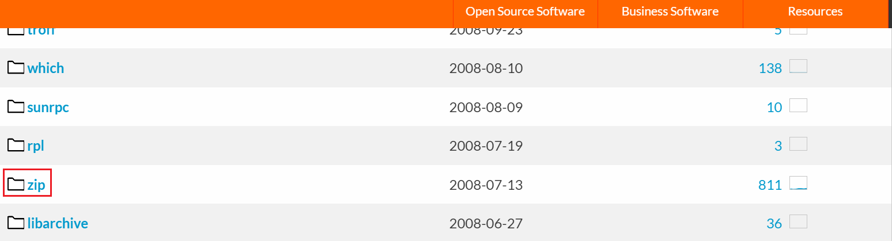

   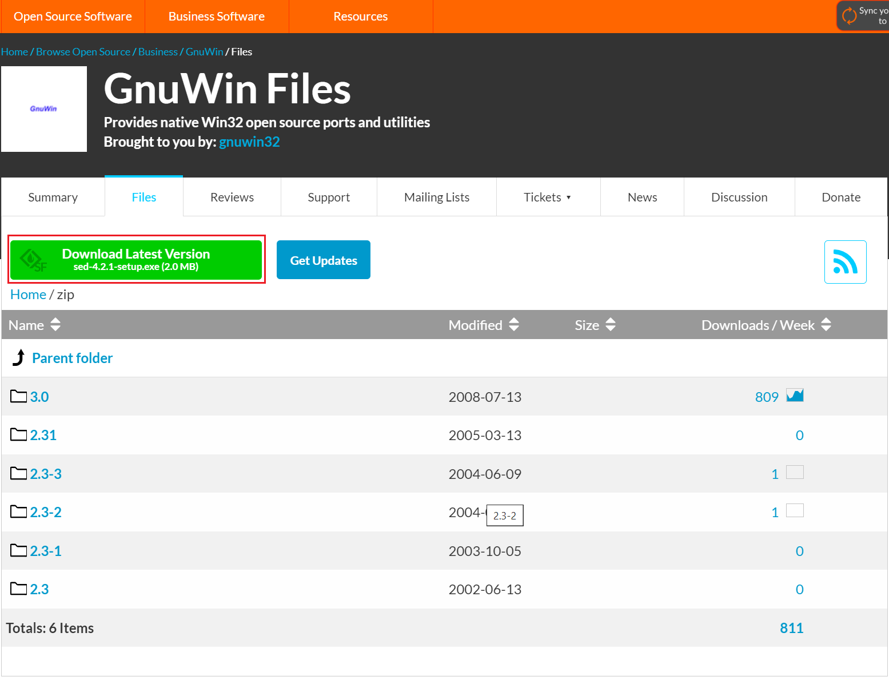

   下载完zip-3.0-bin.zip之后，把里面的zip.exe复制到Git Bash下mingw\bin目录下

3. 运行`curl -s "https://get.sdkman.io" | bash`，注意这个地址不是很稳定，也有一定几率网络连接失败，可以多试试。

4. 在重新打开一个Git Bash或者执行下面的命令就可以把sdkman加入到PATH中，然后就可以使用sdk命令了

   ```bash
   source "$HOME/.sdkman/bin/sdkman-init.sh"
   ```

5. 运行`sdk version`，查看版本

6. SDKMAN基础使用

   ```bash
   $ sdk help
   
   Usage: sdk <command> [candidate] [version]
          sdk offline <enable|disable>
   
      commands:
          install   or i    <candidate> [version] [local-path]
          uninstall or rm   <candidate> <version>
          list      or ls   [candidate]
          use       or u    <candidate> <version>
          default   or d    <candidate> [version]
          current   or c    [candidate]
          upgrade   or ug   [candidate]
          version   or v
          broadcast or b
          help      or h
          offline           [enable|disable]
          selfupdate        [force]
          update
          flush             <broadcast|archives|temp>
   
      candidate  :  the SDK to install: groovy, scala, grails, gradle, kotlin, etc.
                    use list command for comprehensive list of candidates
                    eg: $ sdk list
      version    :  where optional, defaults to latest stable if not provided
                    eg: $ sdk install groovy
      local-path :  optional path to an existing local installation
   ```

7. 使用sdk安装maven（前端不装）

   ```bash
   $ sdk ls maven
   ================================================================================
   Available Maven Versions
   ================================================================================
      * 3.6.3
        3.6.2
        3.6.1
        3.6.0
        3.5.4
        3.5.3
        3.5.2
        3.5.0
        3.3.9
   ================================================================================
   + - local version
   * - installed
   > - currently in use
   ================================================================================
   ```

   ```bash
   $ sdk install maven 3.6.3
   Downloading: maven 3.6.3
   In progress...
   ######################################################################## 100.0%
   Installing: maven 3.6.3
   Done installing!
   Setting maven 3.6.3 as default.
   ```

   ```bash
   $ mvn -v
   Apache Maven 3.6.3 (cecedd343002696d0abb50b32b541b8a6ba2883f)
   Maven home: C:\Users\gary.fu\.sdkman\candidates\maven\current
   Java version: 11.0.3, vendor: Amazon.com Inc., runtime: C:\softs\Java\jdk11.0.3_7
   Default locale: zh_CN, platform encoding: GBK
   OS name: "windows 7", version: "6.1", arch: "amd64", family: "windows"
   ```

9. sdk link 本地已安装的jdk`sdk install java 1.8.0_211 /c/Program\ Files/Java/jdk1.8.0_211`，路径的空格要用反斜杠进行转译

### 安装Flutter

1. 以管理员身份打开powershell窗口
2. 运行`choco install flutter`
3. 重新打开一个powershell窗口，运行`flutter --version`检查是否安装成功


### 安装Flutter版本管理工具FVM

1. 以管理员身份打开powershell窗口

2. 运行`dart pub global activate fvm`或者`choco install fvm`

3. 重新打开一个powershell窗口，运行`fvm --version`检查是否安装成功

4. FVM基础使用

   ```bash
   fvm releases       	  查看可用的flutter发行版本
   fvm install 版本号  	安装指定版本
   fvm list           	  查看已安装的版本
   fvm use 版本号         切换指定版本
   fvm uninstall 版本号   卸载指定版本
   fvm flutter --version 查看当前目录的版本信息
   ```


### 安装Android Studio

1. 下载地址[Download Android Studio & App Tools - Android Developers](https://developer.android.com/studio)，同意协议后开始下载

2. 根据引导程序安装完成，详细过程可以网上找教程。

3. 下载Android SDK

   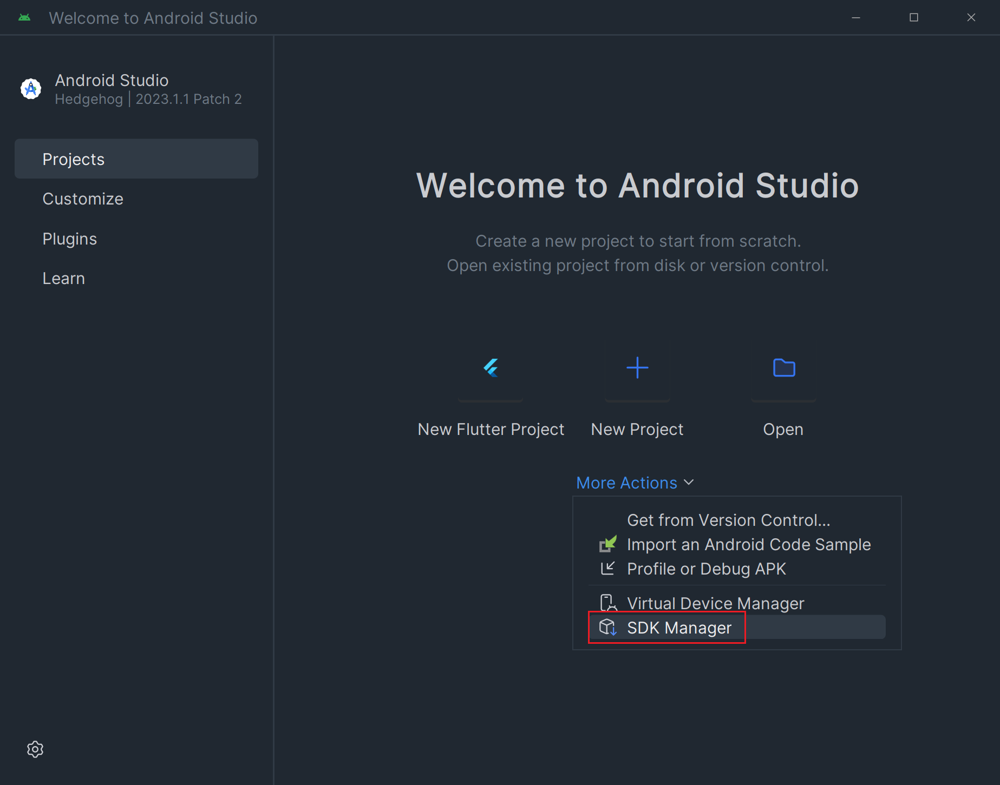

   根据需要勾选常用的SDK

   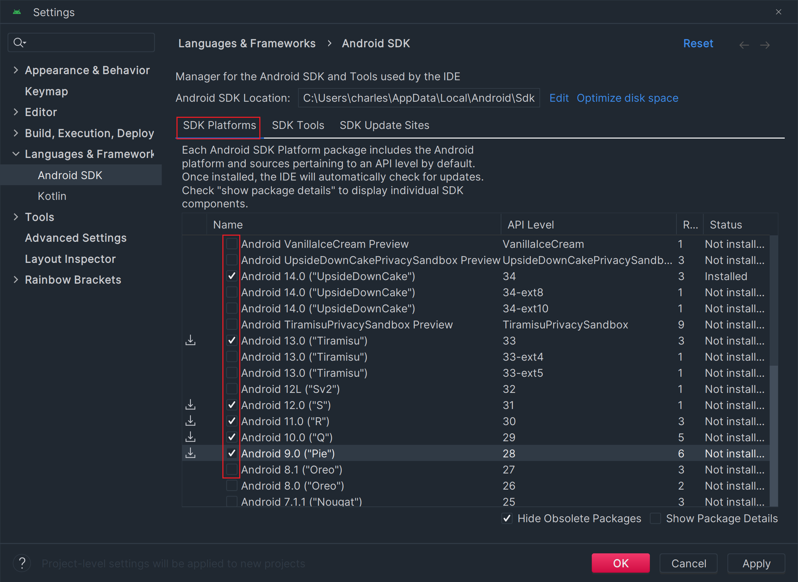

   下载Android SDK Command-line Tools

   

   

   ### 运行flutter项目

   1. 运行`flutter doctor`检查flutter所需依赖是否完备

      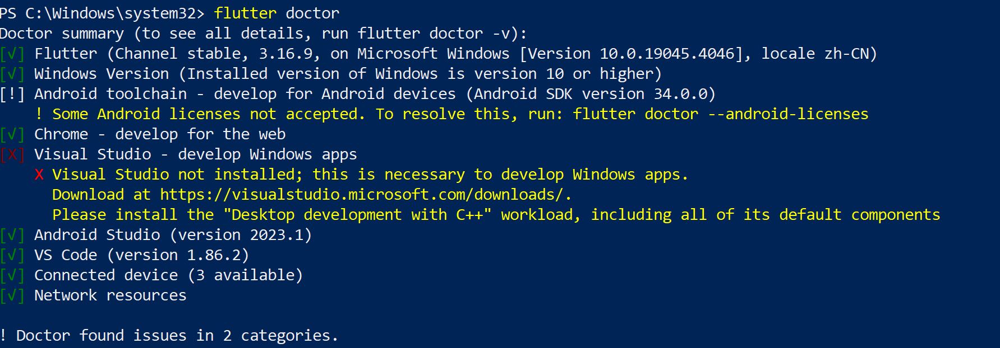

   2. 运行`flutter doctor --android-licenses`接受安卓协议

   3. 使用fvm安装多几个flutter版本，下载慢可以从浏览器下载压缩包拖到fvm的version文件夹中

      ```bash
      fvm install 3.19.1
      fvm install 3.16.9
      ```

      fvm下载地址参考如下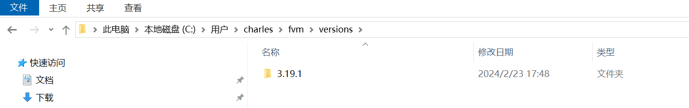

   4. 打开Android Studio，新建Flutter项目

      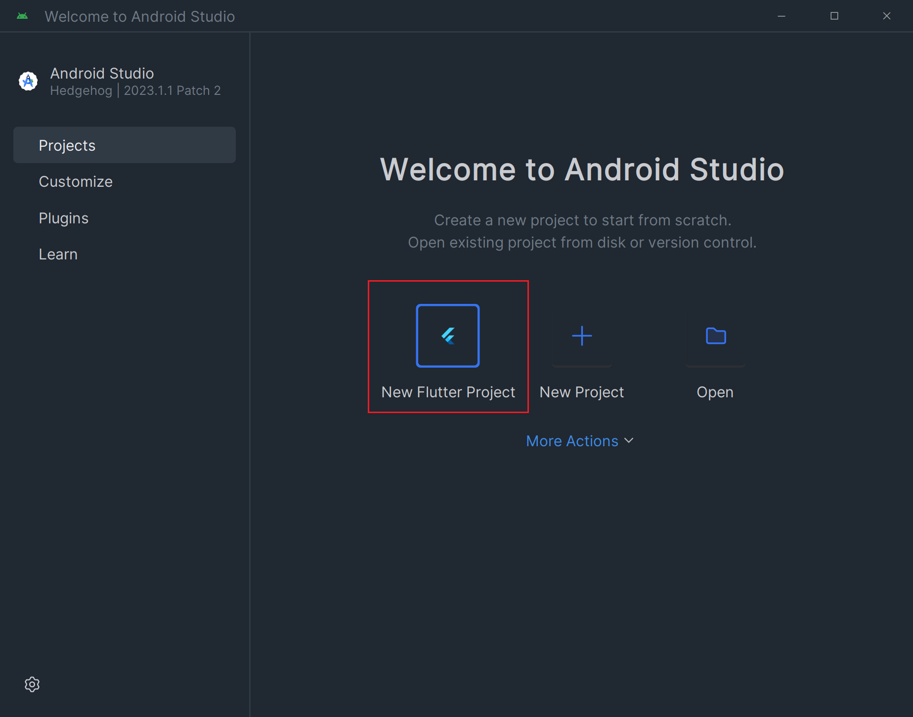

   5. 设置flutter sdk路径

      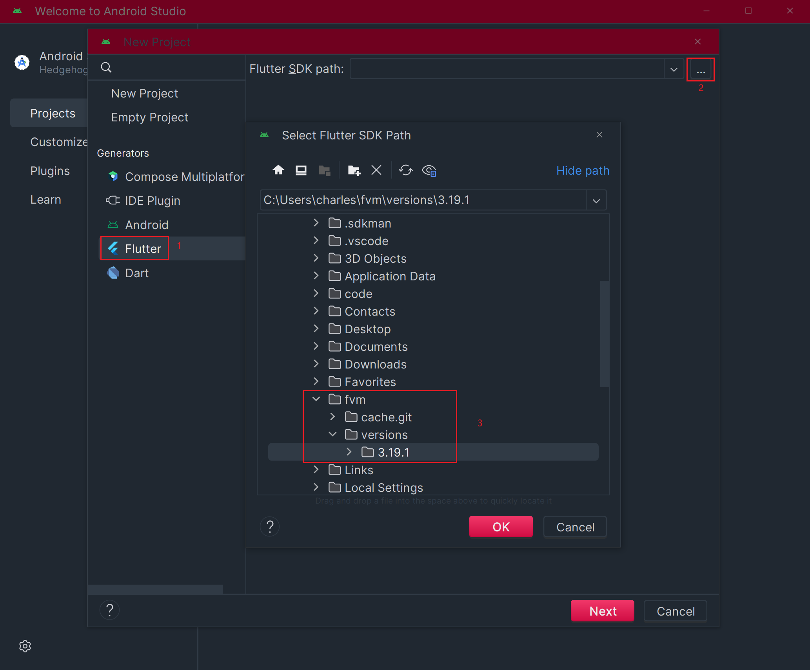

   6. 配置flutter sdk路径

      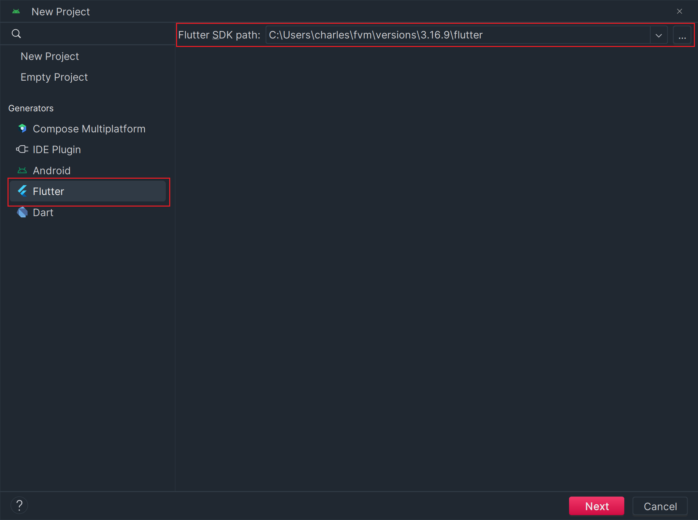

   7. 配置项目名称，只勾选Android、ios、web，开始创建项目

      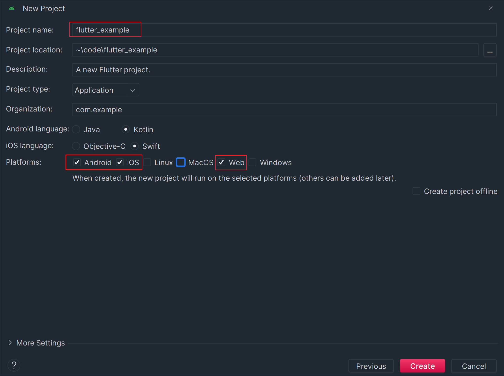

   8. 第一次跑项目会非常漫长，可能要30分钟，请耐心等待

   

## 进阶

### Windows 通过 Git Bash 配置 Oh My Zsh

参考：[Windows 通过 Git Bash 配置 Oh My Zsh - Seepine's Blog](https://www.seepine.com/git/oh-my-zsh/)

​	

### 谷歌插件

参考：https://juejin.cn/post/6998300409173377032#heading-14


## 常见问题

### Windows使用fvm use命令报错

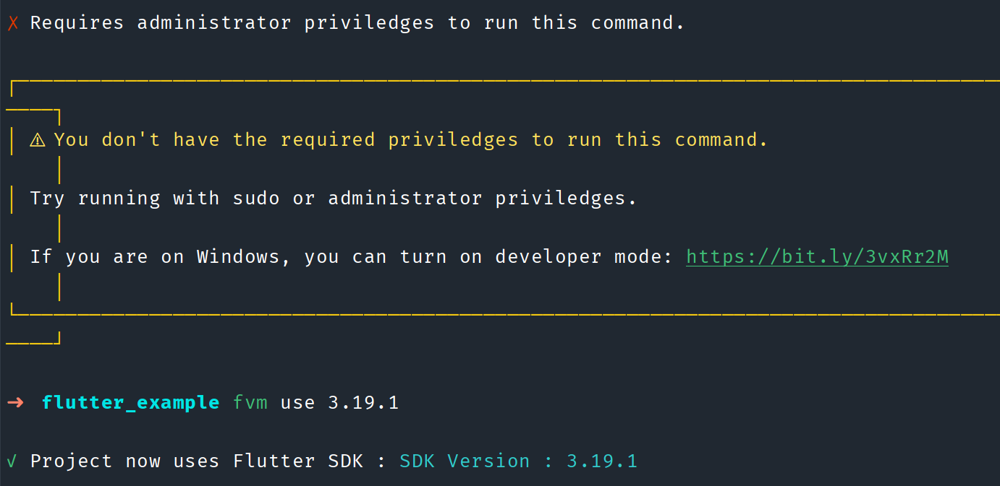

需要开启开发人员模式

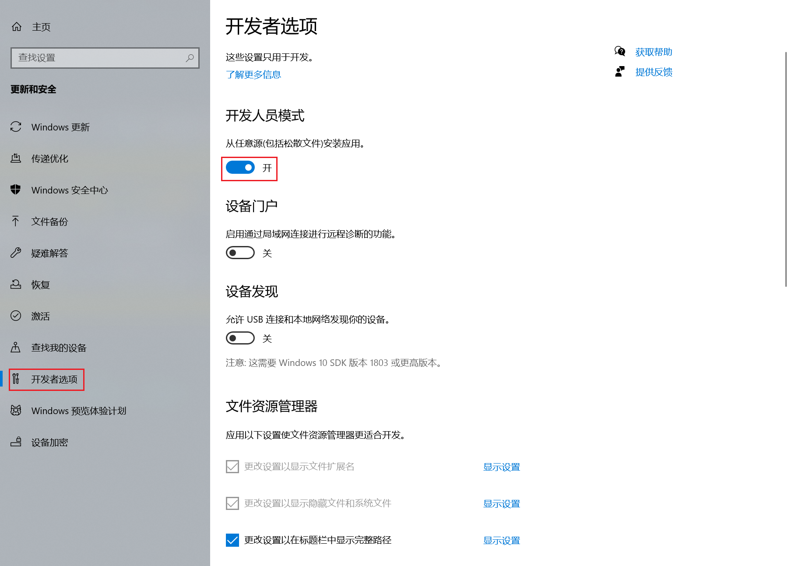

### 运行flutter报错1

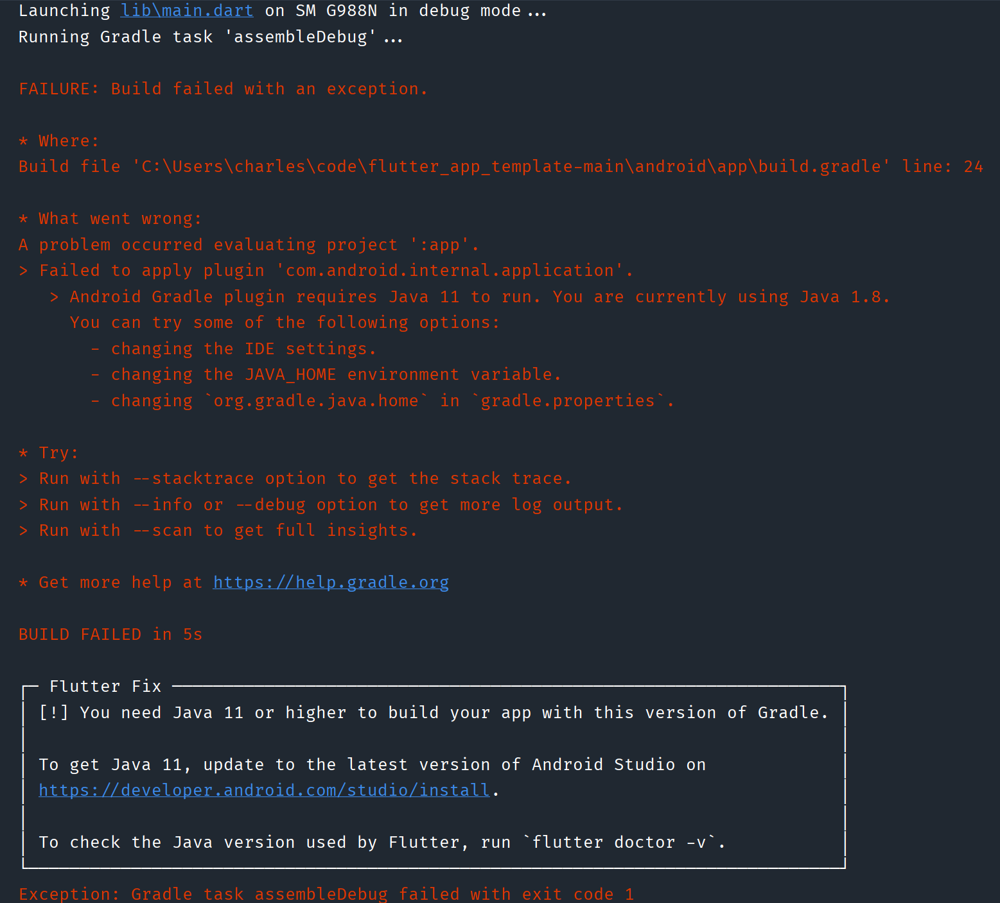

解决办法：

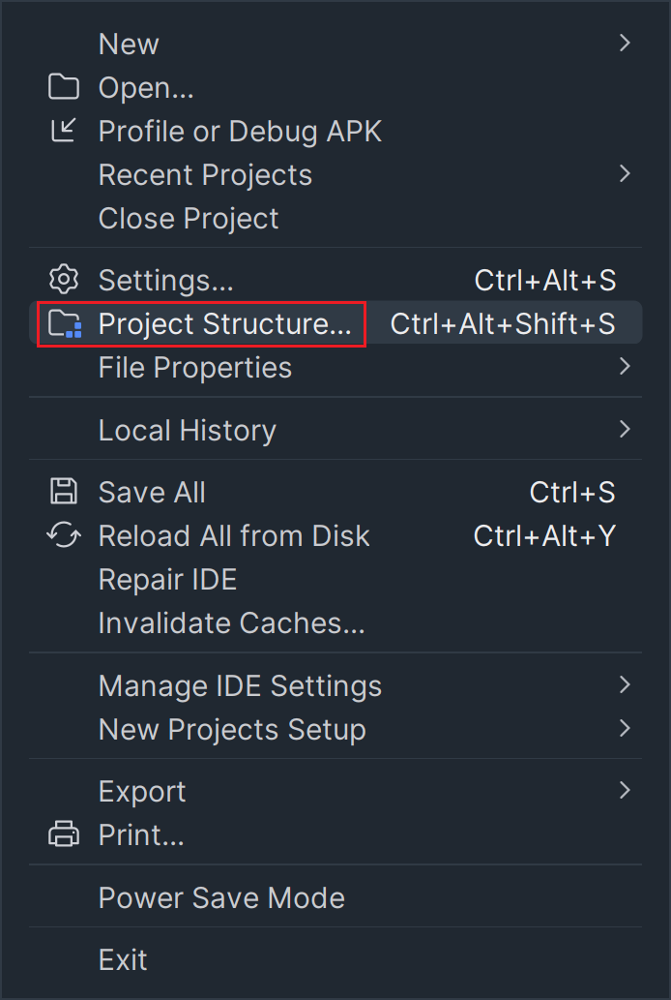

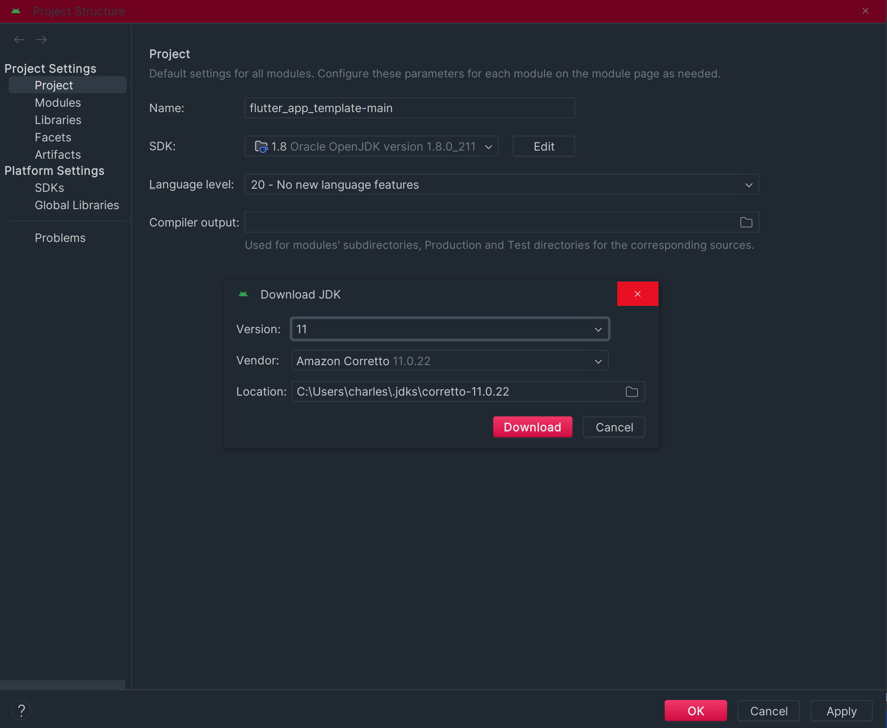


### 连接夜神模拟器

1. 进入夜神安装目录的bin目录

2. 运行`nox_adb.exe connect 127.0.0.1:62001`

### flutter 命令报错


运行`git config --global --add safe.directory '*'`可解决


### Windows下Webstorm全局查找 ctlr+shift+f 快捷键冲突无反应

1. 右键单击任务栏图标


2. 选择设置

   

   3. 选择按键

   

   4. 简繁切换关掉

      

## GitLab拉取代码

内网权限必须先开放，hosts映射设置完成

1. 询问gitlab账号，并进项目

2. 完成google authenticator 绑定

3. 设置Access Tokens

   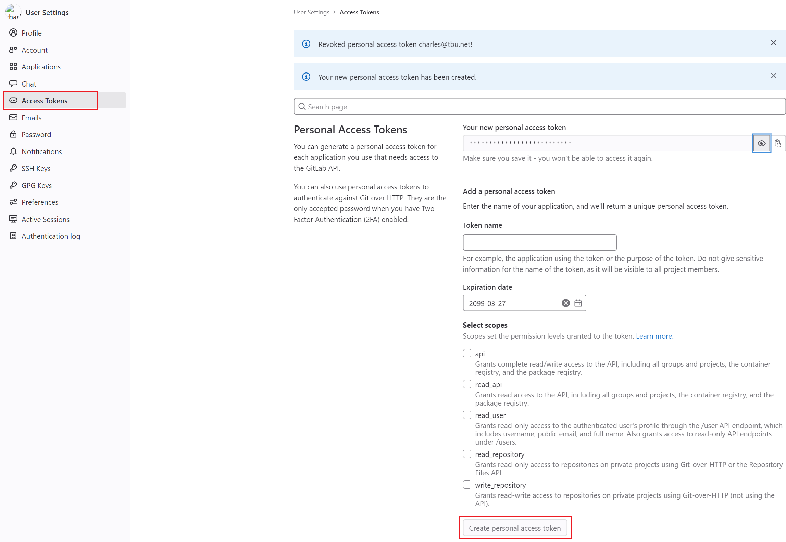

4. 如果提示https证书错误，使用 `git config --global http.sslVerify false`


