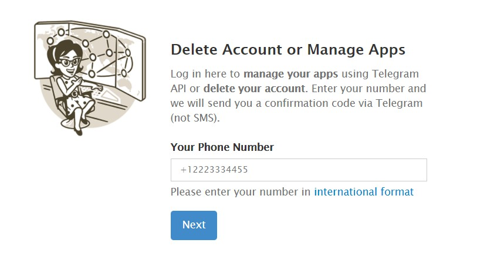
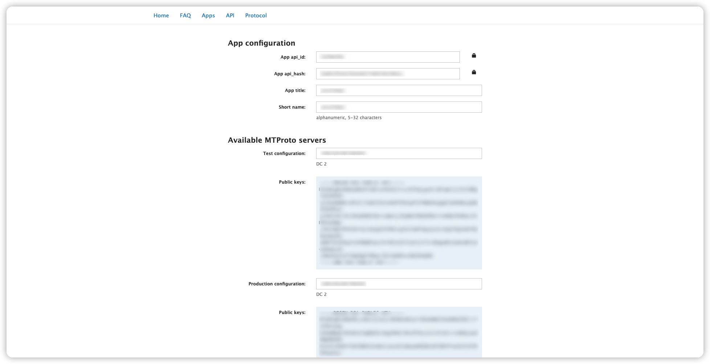
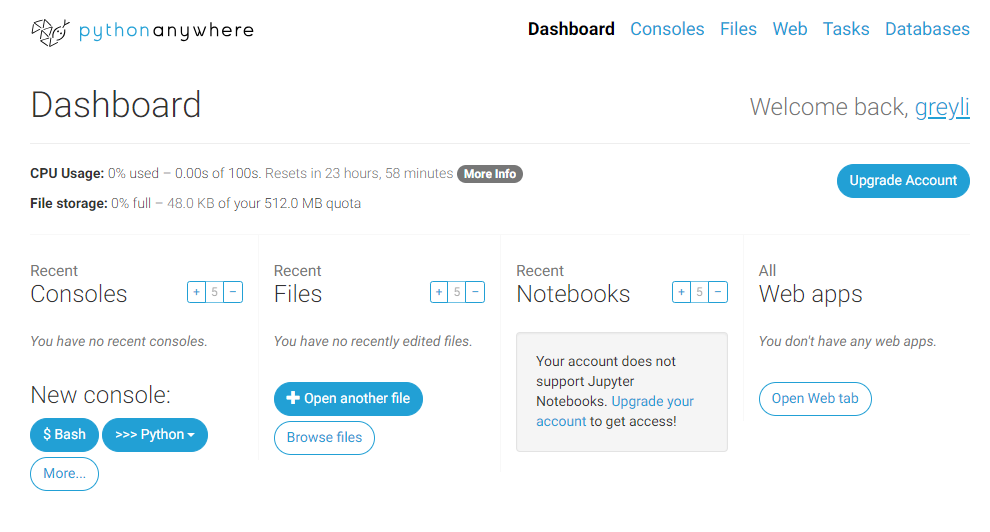
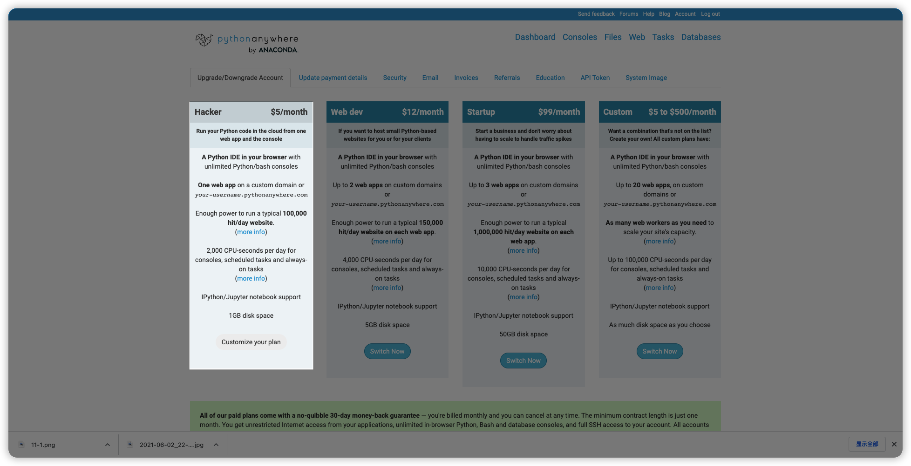
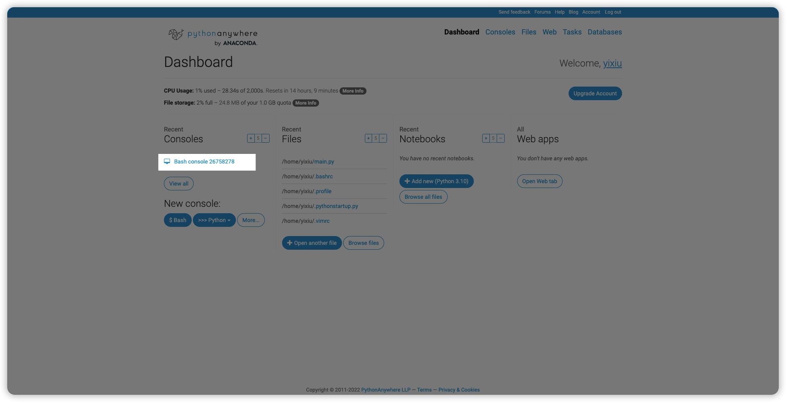
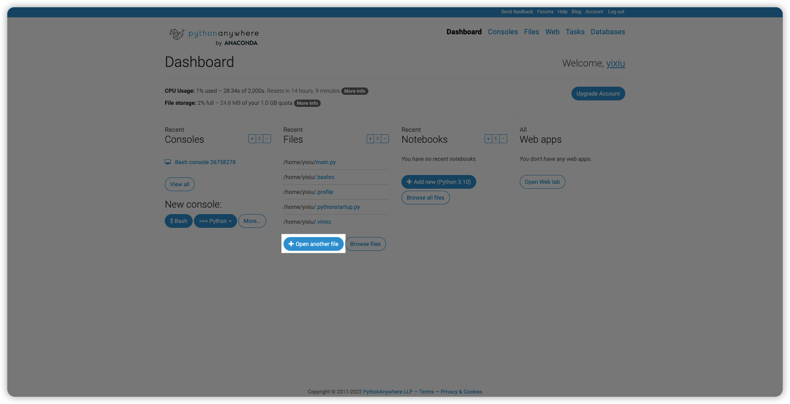
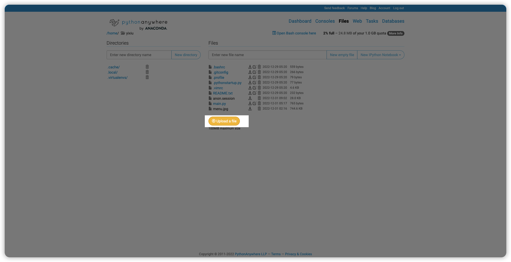
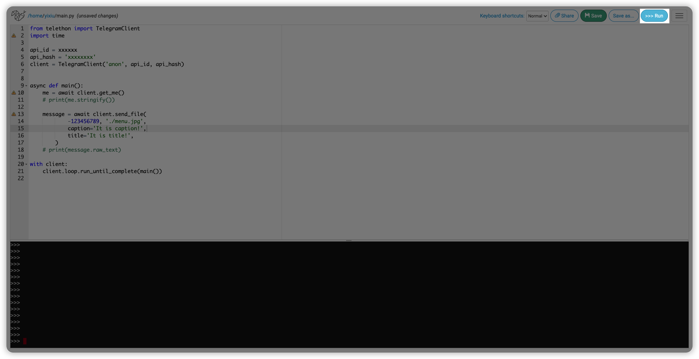
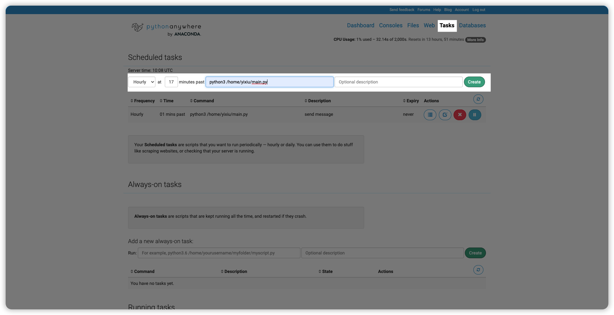

## 开发环境
以mac os为例
### 安装python
```bash
# 安装
brew install python3

# 检测版本
python --version
```

### 安装telethon
一个简单易用的telegram api三方库。
[telethon文档](https://docs.telethon.dev/en/stable/#)

```bash
# 安装
python3 -m pip install --upgrade pip
python3 -m pip install --upgrade telethon

# 检测版本
python3 -c "import telethon; print(telethon.__version__)"
```

## 账号准备
使用手机号注册一个telegram账号。

### 获取api_id和api_hash
- 进入[https://my.telegram.org/](https://my.telegram.org/)
- 登陆你的telegram账户
- 点击API development tools
- 填写表格并提交

登录界面


如果碰到以下错误，耐心重复提交几次


成功后如下：


## 本地调试
可以使用VSCode或其他编辑器进行本地调试
```python
from telethon import TelegramClient

api_id = xxxxxxx
api_hash = 'xxxxxxx'
client = TelegramClient('anon', api_id, api_hash)

async def main():
    me = await client.get_me()
    # print(me.stringify())

    # -0000000换成你想发送的群id
    message = await client.send_file(
            -0000000, './a.jpg',
            caption='It is caption',
            title='It is title!',
        )
    # print(message.raw_text)

with client:
    client.loop.run_until_complete(main())
```

运行后会提示你输入以下信息：
```bash
Please enter your phone (or bot token): +86123456789
Please enter the code you received: 11631
Signed in successfully as powersee
```

查看telegram验证消息是否发送成功。

## 服务托管
### 注册pythonanywhere账号
[https://www.pythonanywhere.com/](https://www.pythonanywhere.com/)



### 升级账户
必须升级账号才能调用telegram api


### 安装依赖
在Consoles栏点击Bash console 进入bash界面。


输入以下命令安装telethon：
```bash
# 安装
python3 -m pip install --upgrade pip
python3 -m pip install --upgrade telethon

# 检测版本
python3 -c "import telethon; print(telethon.__version__)"
```

### 添加文件
在Files栏点击Open another file。


在弹窗输入框中输入/home/demo

点击 Upload a file 将本地之前写好的python文件上传。


### 运行一下
测试一下是否可以发送


### 定时任务
设置每小时运行


## 完结
:tada::tada::tada: