# MarketPlace

### PWA
- update popover
- offline access
- web cache
- desktop installation

### Comments
Communicate with your users 
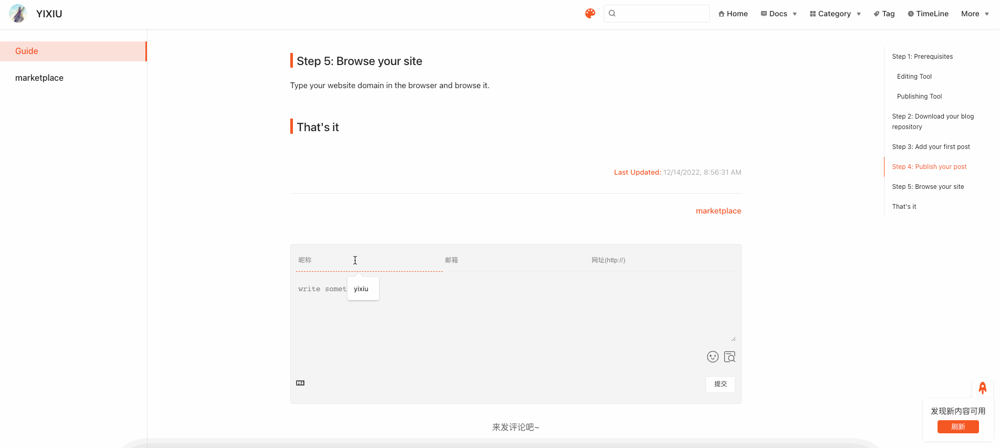

### Bulletin-popover
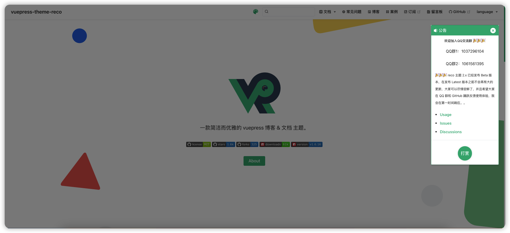

### Bgm-player
Play your owe music

### RSS
Get people to subscribe to your blog
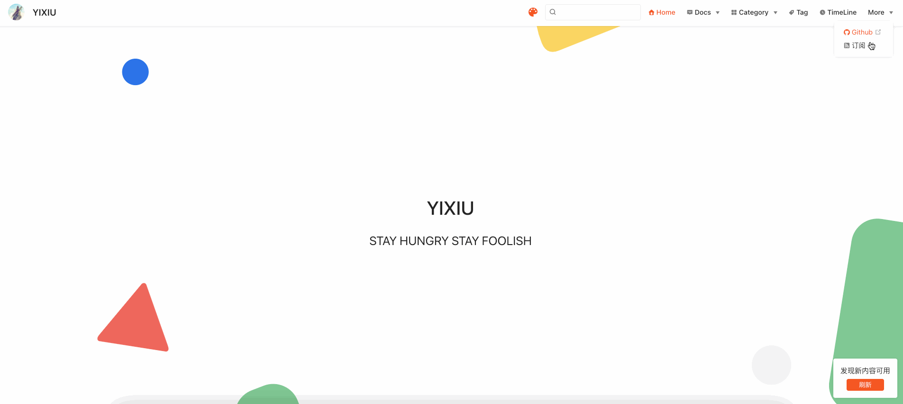

### Sponsor
Get sponsorship from your users
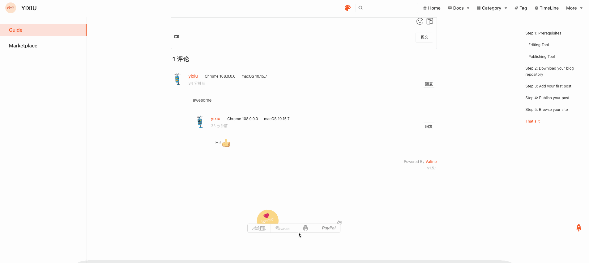

<!-- ### Image zoom
zoom your Image -->
### Sitemap
Search engine optimization techniques to make your website more searchable

### Article-encryption
Encrypt your posts
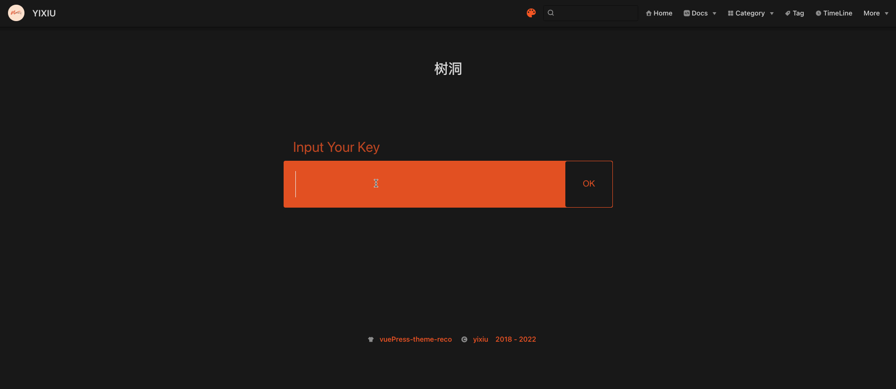

### Ribbon
Add beautiful ribbons to your Website!
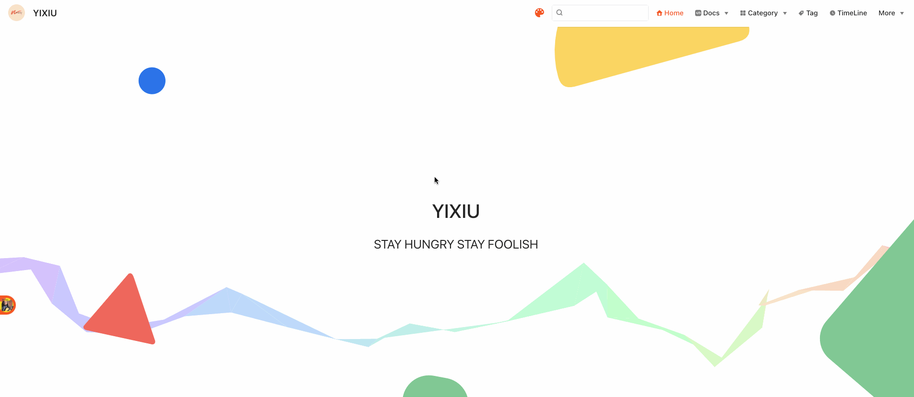
### Cursor-effects
Add cute cursor effects to your vuepress!
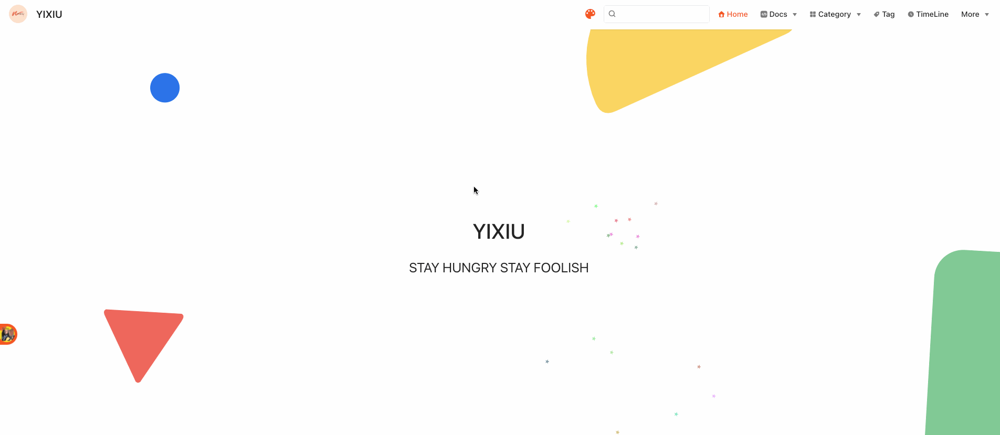

### Go-top
🐾 Click such a lovely cat to back to top!
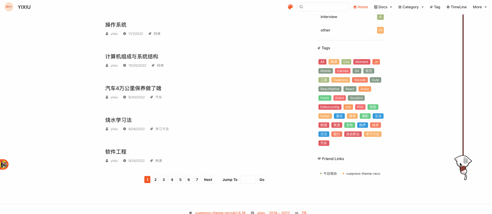

### Mailchimp
Email marketing
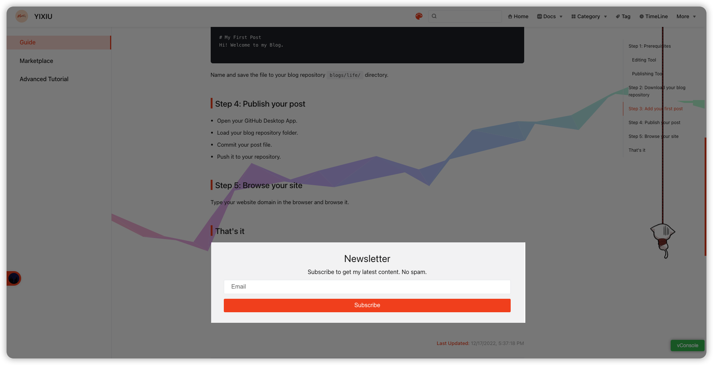

### Google-analytics 
View your website reports with Google Analytics
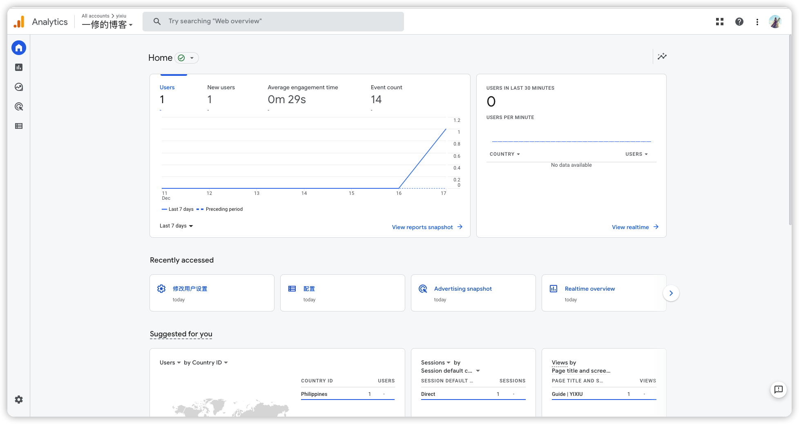

### Google-adsense ad
Turn on your Google Ads revenue
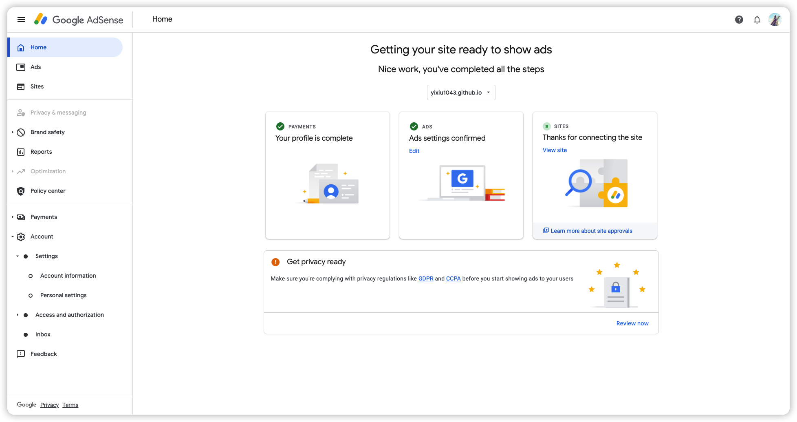